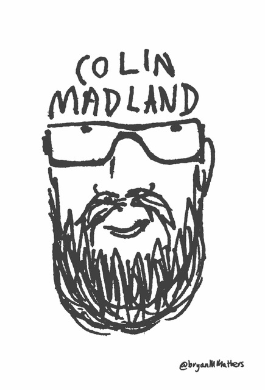

## Welcome!

This is the landing page for courses I have taught. Each link below is a self-contained course, although there may be hidden content to protect the privacy of learners.

I’m a PhD student in Educational Technology in the department of Curriculum and Instruction at UVic. My research has taken a turn with the impact of SARS-CoV-2 (the virus) and COVID-19 (the disease it causes), and much remains to be determined on that front, but I’m very interested in assessment practices in higher ed and how faculty can ensure that their methods of assessment are actually measuring student learning in ways that are equitable, valid, and reliable.

In my day job, I’m Manager of Online Learning and Instructional Technology at Trinity Western University in Langley BC, where I have been on the front lines of TWU’s pivot to emergency remote teaching. As you might have experienced this spring, that is a significant challenge for universities that are traditionally face-to-face, in-person operations.

Prior to my time there, I was e-Learning Facilitator at Thompson Rivers University in Kamloops, BC. During my time at TRU, I completed my Master of Education (Distance Education) through Athabasca University, where my thesis explored a cooperative learning activity.

I currently live in Richmond with my wife, two of our three kids, and our two cats. Our oldest son is married and living in Kamloops where he just finished his Bachelor of Interdisciplinary Studies at TRU, and his wife is just finished her first year of the Bachelor of Education program, also at TRU. Our daughter just finished her third year at TWU and her second year in the Bachelor of Science in Nursing. Our youngest son is just finished grade 6 and loves to run around and play drums.

You can find me on the web in various locations. My website is [https://grav.madland.ca](grav.madland.ca), where I am blogging my way through my PhD; I’m on Twitter and am quite active there; I do a lot of work in GitHub, both personally and professionally; if you dig a bit, you might find me on Instagram where I post pics of BBQ. You”ll find that most of my Social Media avatars are this image, which was created by Bryan Mathers in the UK.

!!!! Want to learn more about this site? Visit the multicourse hub documentation at [learn.hibbittsdesign.org](https://learn.hibbittsdesign.org/opencoursehub/multicourse-hubs).
