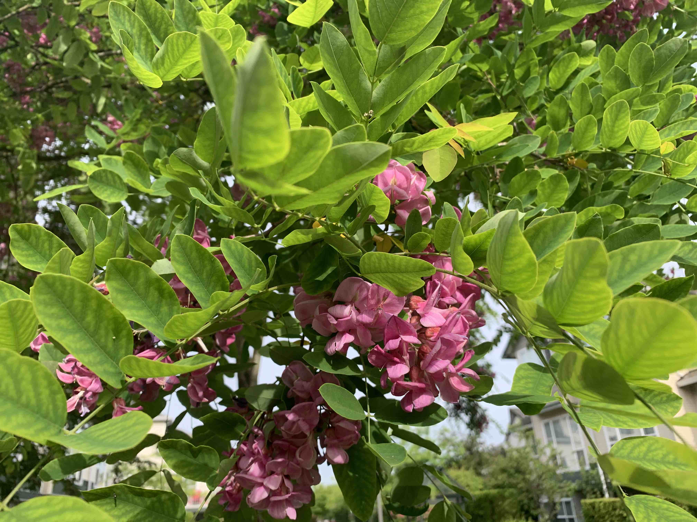

Hello everyone!

I hope it is as sunny where you are as it has been here in Richmond! Each morning, when I do most of my reading and writing for EDCI 335, I have a great view of this tree just outside my window.

It blooms quite late in the spring and it very colourful in the morning sun, but I don't know what kind of tree it is...here is a closer view.

Anyways, we are coming to the end of week 4 of the course and I am grateful for the work you are doing! I have read everyone's first post on the various learning theories discussed and also [left comments using hypothes.is](https://web.hypothes.is/start). Each of you should have received an email with instructions for accessing those comments in the private group that I created. Only you and i can see the comments in those groups.

You should be well on your way to completing your second post for the course and working with your Learning Pod to begin drafting your [first graded assignment, the learning design blueprint](https://edtechuvic.ca/edci335/learning-design-blueprint/). The blueprint is due on June 14, so you still have lots of time to work on it, but keep in mind that everything takes longer to accomplish when you are working online and remotely, especially if you are working across several time-zones.

As a reminder, I am not grading all of your posts, but you must complete them all. At the end of the course, you will choose one of your posts which you will polish and revise for submission for a grade, but you must have completed all five posts.

Many of you have started to include links to each others' posts, and that is excellent. You should notice on your own blog, that those mentions are tracked and you will receive a notification that you have a comment with a link to the other post. Please sign into your site and approve those comments so that they are visible on the front end of your site. That will help us build a networked community of learning as we progress through the course.

I will be out of town next week, and my access to the web will be limited. For a few days (Tuesday-Thursday or Friday), I will be camping with my wife as we celebrate our 25th wedding anniversary. During those few days, I will not have access to the web, so you may not hear from me.

#### Here is a Twitter thread about me feeling old.

<a class="embedly-card" data-card-controls="0" href="https://twitter.com/colinmadland/status/1265857654791868416?s=20">Colin Madland on Twitter</a>

I will publish a post Monday morning, as usual, then will be able to check back in Friday or Saturday. Please work with your Learning Pods to answer any questions you might have.

As a reminder, here are your tasks for this week. I look forward to reading your second posts!

[plugin:content-inject](../w4/_week-4)
