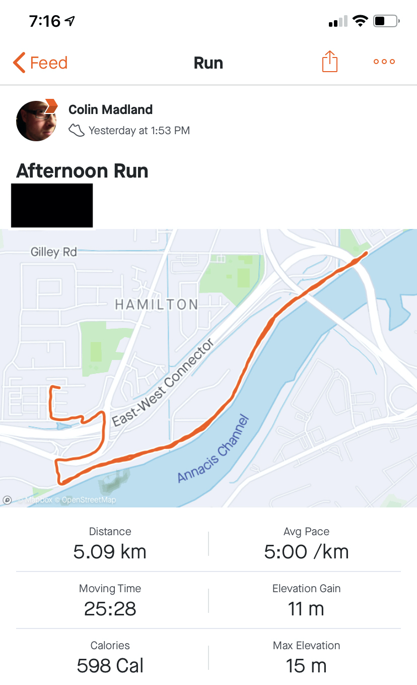

[plugin:content-inject](../w8/_week-8)

Summer is here, and I hope you are able to get some beach time in a socially distanced way, kinda like the guy in the header pic who looks white, but is going to be real red by the end of the day...

Good morning (or afternoon or whatever...) everyone! I trust you all had a good weekend and are ready for another week! My weekend was pretty busy, but I'm pleased to report that my tomato plants are flowering, as are the peppers, so it seems likely that I'll be able to make my salsa despite all the rain in the last couple weeks. Also, I finally set a personal record running 5k with an average pace of 5:00/km, so I'm pretty pleased with that.

But, enough of that...we've still got work to do. We are well into the back half of EDCI335 and the remainder of the course will likely go very quickly. We have 3 more units where new content will be introduced and discussed followed by a couple weeks for you all to focus on your interactive learning resource assignments, including a peer review activity.

So far, you should have completed the following...

[plugin:content-inject](../w8/_completed)

You should know that I mean it when I say that I am grateful for your work in this course. Your blueprints were very well done and it was a pleasure speaking with each of you over the last week about your thoughts on the assignment and to meet many of you for the first time. As I mentioned to each of you, if you have any questions of concerns about the course, or if you are having particular challenges (whether COVID-19 related or not), please let me know. There are many ways we can work together to ensure your success in the course.

This week, we are going to think about `interaction` and how to design for it in your interactive learning resource. Obviously, interactivity should be front-and-centre in a project called '*interactive* learning resource'! 

Your list of tasks for the week is at the top of this page and also on the [Schedule page on the course site](https://edtechuvic.ca/edci335/a01-schedule-with-colin/).

As always, please let me know if you have questions!

! Close this window to return to the course.