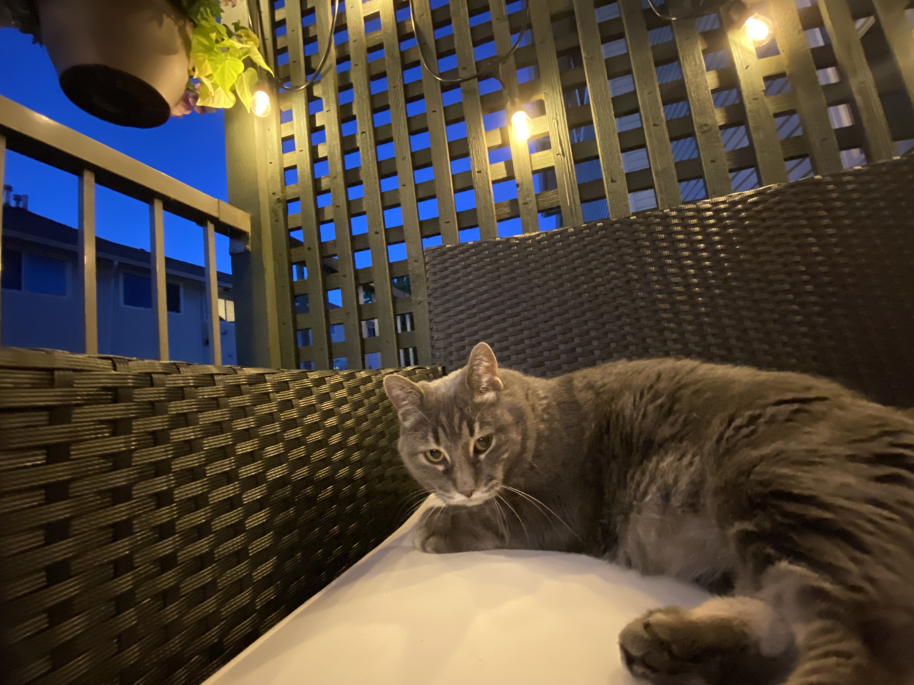

[plugin:content-inject](_week-5)

Good morning or evening everyone!

I'm out on the deck this evening with one of my teaching assistants, Dexter.

Thank you for your work last week! It has been good to see your posts and blueprints come in! I had several great conversations with groups in the planning stages of your blueprints, so I'm confident that they will be well done. As you know, deadlines are meant to be guidelines. They are certainly helpful for planning your work, and it can be difficult to catch up if you fall too far behind, however, I will never deduct grades for lateness as I believe that to be an inequitable practice that disproportionately harms some people (parents, people with jobs, people in a pandemic...). I do ask that you keep me up to date so I know when to expect to see your work.

I am admittedly late to the game regarding inclusive design, so the posts in this topic heavily rely on Heidi's (teaching section A02) expertise. I'm grateful for being able to partner with her to teach this course.
