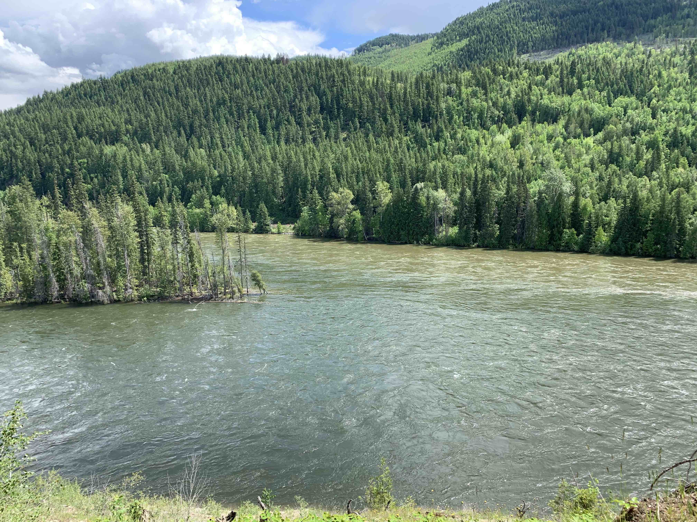

[plugin:content-inject](_week-6)

I trust you all had a good week! I spent most of my time in a campground in my hometown of Clearwater, BC. North Thompson Provincial Park is at the confluence of the Clearwater and North Thompson Rivers, an area that was used by Indigenous People for thousands of years. Visitors to the park can still see the remains of the pit houses or 'kekuli' that people used for shelter. In the picture below, you can see the muddier North Thompson River at the top and the greener Clearwater River at the bottom.

At any rate, you all continued with your work (I have a lot to catch up on!) and I'm grateful for that, as well as the few questions I got over the week. I believe I responded to everyone yesterday, but please let me know if you still have questions.

Keep in mind that we have adjusted our schedule a little bit and switched the unit on inclusion with assessment, so the order of the units in the menu no longer aligns with our progress.

The next two weeks will be spent reading and thinking about assessment and you working to finish your [Blueprints](https://edtechuvic.ca/edci335/learning-design-blueprint/), which are due on Sunday, June 14. The blueprint assignment is the planning stage for the Interactive Learning Resource assignment and it must be submitted before the Interactive Learning Resource. The purpose of the blueprint is to get you to think through the implications of some of the decisions that you will make with respect to the learning resource. For example, if you decide that you will be writing the learning resource for an audience of K-12 learners, you will take a different approach than if you were writing it for a group of corporate executives.

The blueprint will allow you to see clearly how your outcomes are aligned with your assessments and also how the learning activities will help learners succeed on the assessments.

If you have questions about your work on the blueprint, please let me know as soon as possible and we can arrange to meet to discuss ways forward.

There isn't a post that you need to compose during this unit, [but we have provided some resources on the course site to help you learn and think about how to assess learning.](https://edtechuvic.ca/edci335/category/assessment/) You should ensure that the ideas in this unit on assessment are visible in your blueprint and also later in your learning resource.

Please keep in touch if you have questions!
