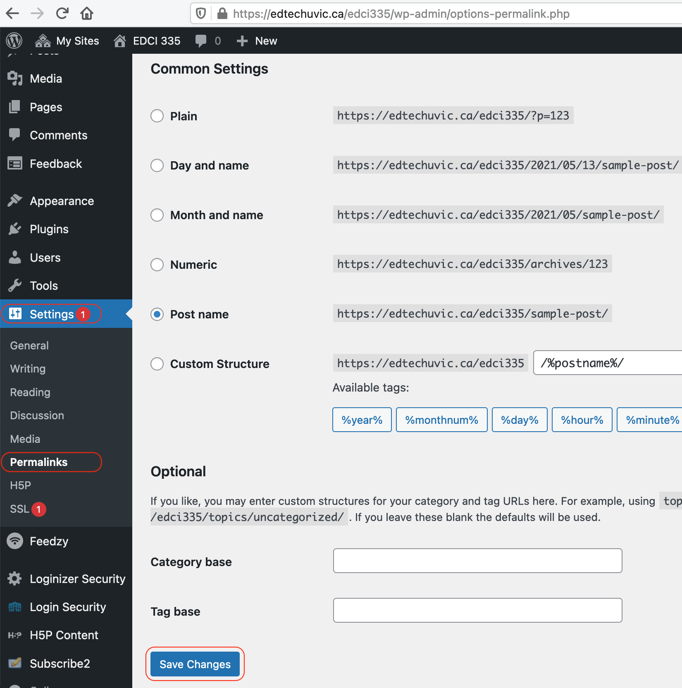

Several people have mentioned and shown that there is something weird going on with their posts, and I have a solution for you to try. It seems that there is something goofy with the `permalinks` on your sites. A permalink is the WordPress lingo for the direct link to an individual post. For example, the permalink for the 'Learning Theories' post is `https://edtechuvic.ca/edci335/learning-theories/`. WordPress allows administrators to chose the style of permalink they want to use. The example above just uses the post name, but you can also choose to include the date of your post in the permalink. This can be handy for seeing exactly when a post is published.

Something seems to have gotten messed up, but the fix is super easy!

Go to your dashboard and click `Settings`, then `Permalinks`. From there, you can change the style of permalink you want to use, or not, but you do need to click `Save Changes`, and that should resolve the issue.

