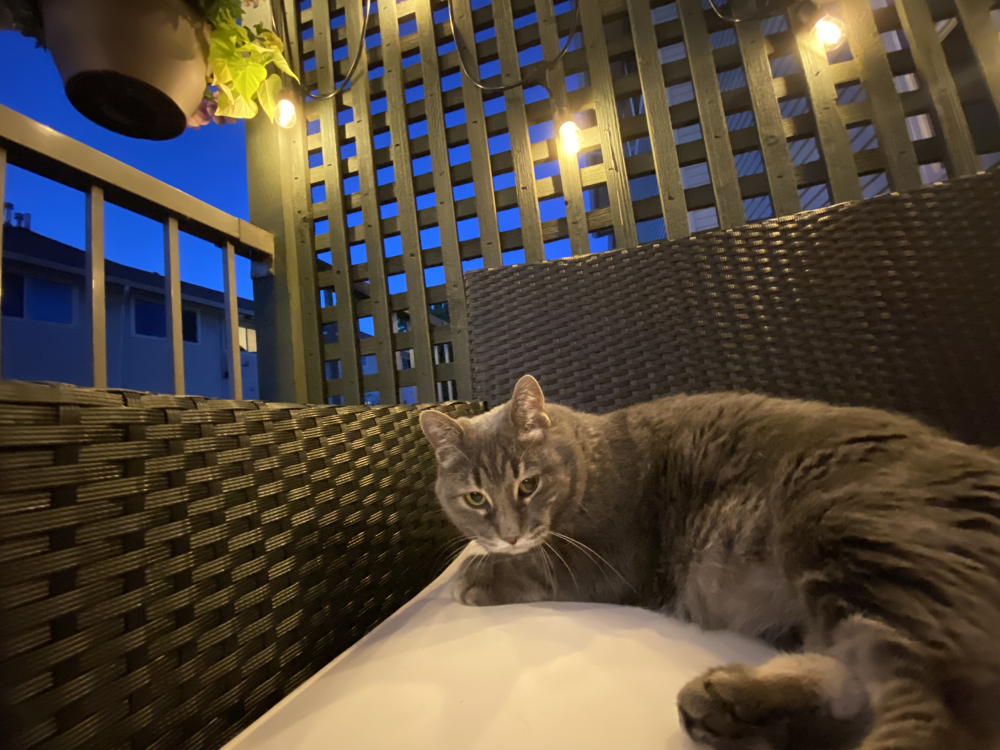

[plugin:content-inject](_week-5)

Good morning or evening everyone!

I'm out on the deck this evening with one of my teaching assistants, Dexter.

Thank you for your work last week! It has been good to see your posts and blueprints come in! I had several great conversations with groups in the planning stages of your blueprints, so I'm confident that they will be well done.

As you know, deadlines are meant to be guidelines. They are certainly helpful for planning your work, and it can be difficult to catch up if you fall too far behind, however, I will never deduct grades for lateness as I believe that to be an inequitable practice that disproportionately harms some people (parents, people with jobs, people in a pandemic...). I do ask that you keep me up to date so I know when to expect to see your work.

I am admittedly late to the game regarding inclusive design, so the posts in this topic heavily rely on Heidi's (teaching section A02) expertise. I'm grateful for being able to partner with her to teach this course. [I encourage you to go read her post for this topic.](https://edtechuvic.ca/hjames/inclusive-design/)

As you read about inclusive and universal design, consider your Interactive Learning Resource, where you will have to design with at least two barriers in mind. The advantage of doing this for people who need it is that everyone generally benefits from inclusive design. Think of curb cuts on sidewalks...

 By <a href="https://en.wikipedia.org/wiki/Curb_cut#/media/File:Pram_Ramp.jpg" class="new" class="int-own-work" lang="en"&gt;Own work&lt;/span&gt;, Public Domain, <a href="https://commons.wikimedia.org/w/index.php?curid=12038367">Michael3 on Wikipedia</a>

These were originally cut specifically for people who use wheelchairs, but they benefit a much wider variety of people, like cyclists, skateboarders, people who have vision challenges, parents pushing strollers, all of whom need to move between roads and sidewalks, and who can do so more easily because we decided to include people who use wheelchairs. The same principle works in learning environments.

When we use design principles that include, everyone benefits.

I hope you'll be able to follow the #accessAbility hashtag on Twitter this week and that you'll be able to interact with section A02 in the Padlet linked above.

I have a super busy week as I am presenting at and attending, and helping organize and run the #OTESSA21 conference this week until Thursday (feel free to check out that hashtag on Twitter too!), so I won't be able to join the Tuesday morning fun, but Heidi will be there. I'm looking forward to checking out your blueprints later this week!

Cheering you on!!

Colin
