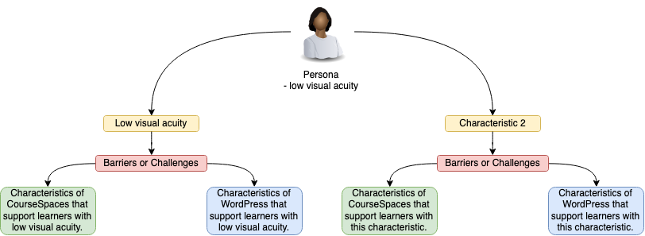

[plugin:content-inject](_important-reminders)

Here are some ideas for helping you think through the requirements of the [Digital Equity and Perspectives pod project.](https://edtechuvic.ca/edci339/digital-equity-perspective-pod-project/)

#### Goals of the assignment

I want you to critically examine digital equity in distributed and open learning environments. To do this, you are asked to compare and contrast `distributed` learning environments with `open` learning environments. To help you think about the differences between distributed and open environments, you can consider that EDCI 339 began in a typical *distributed* model (CourseSpaces allows for learners to connect remotely and asynchronously but everything is locked behind a password and login), and now we have changed to an *open* model, where learners can still connect asynchronously, but our interactions and ideas are openly accessible on the web. The knowledge that we generate can be shared because it is accessible. Anyone `with an internet connection` can join along if they'd like (but they won't get credit).

The fact that open learners need an internet connection implies that they have a few other things, like a device (computer, tablet, phone), time (to read and write), the ability to interact with the materials in a way that is suitable for them (audio if they are unable to see well), bandwidth (to be able to access large files like video), and any number of other things.

It is the differential ability to already have access to all these other things that created `inequity`. Some people have vision impairments and require a screen reader, other people don't have access to a quiet place to study, or they only have access to a mobile phone with an expensive data plan, so they can't download videos.

#### Building a Persona

The first part of the assignment will require you to build a persona, which is a snapshot of a fictional learner, but who is based on the actual characteristics of actual people. For the purposes of this assignment, you can build a persona by brainstorming different characteristics. You do not need to gather actual data.

:fa-link: [You can find resources on building a persona here, along with examples.](https://medium.com/@juliahuprich/building-learner-personas-for-instructional-design-effectiveness-8787d4e5d1d2)  

:fa-link: [Check page 4-5 of this PDF for examples of personas.](https://opennetworkedlearning.files.wordpress.com/2015/05/the-7cs-of-learning-design.pdf)  

#### Sample Charts

Once you have developed a persona, you need to build some way to compare and contrast the affordances of `distributed` learning environments with `open` learning environments to meet the unique needs of your persona. One simple way to do this is with a table...

| Persona Characteristic | Barriers or Challenges | Distributed Environments | Open Environments |
|---|---|---|---|
| Low visual acuity   | Can't read text on a screen  | [Use this space to describe how a `distributed` tool, like CourseSpaces (which is Moodle) accommodates a person with low visual acuity.]   | [Use this space to describe how an `open` tool, like WordPress, accommodates a person with low visual acuity]   |

Or, you could create a mind-map...

!!!! I created this mind map with a tool called draw.io. You can access this tool for free by going to [apps.opened.ca](https://apps.opened.ca) and signing in with your uvic.ca email address, then installing draw.io. Let me know if you need assistance.

#### Pitch

The idea behind the pitch is for you to concisely summarize your recommendations for your persona to decide to either take a course in a `distributed` environment (like CourseSpaces), or in an `open` environment (like WordPress).

#### Sample Questions

There are many different ways to think about how inequity influences learning environments...you do not have to address all of these questions (you could choose one of the following questions for each member of your learning pod).

- Will your persona be learning all online, face-to-face, or a combination of both?  
- Describe the “mediums” in which this persona might be learning.    
- Where would the learning be `asynchronous` or `synchronous`? Why?  
- List or describe any digital tools that might be considered to support distributed or open learning.  
- How would you describe this student’s ideal learning context?  
- What are the real and perceived barriers to learning that are preventing safe, flexible and supportive learning experiences and environments for this persona?  
- Are there real or perceived  equity, social justice or cultural considerations that may be preventing safe, flexible and supportive learning experiences and environments for this persona?  
- :fa-link:[Check here for more information on the following questions.](http://udlguidelines.cast.org/)  
  - How could your learning design support multiple means of engagement?  
  - How could your learning design support multiple means of representation?  
  - How could your learning design support multiple means of action and expression?  

#### Formats

There have been some questions about the format of the assignment.
:fa-check: You should create a new site on opened.ca for your pod to share and host the materials for the project.  
:fa-check: You may be creative in how you format the assignment. We have suggested that you could use video in a tool called :fa-link:[FlipGrid](https://flipgrid.com), ***OR*** you can choose to use a text-based format. FlipGrid limits an individual video to 2 minutes.  
:fa-check: You may also use another format according to your pod's preferences.
