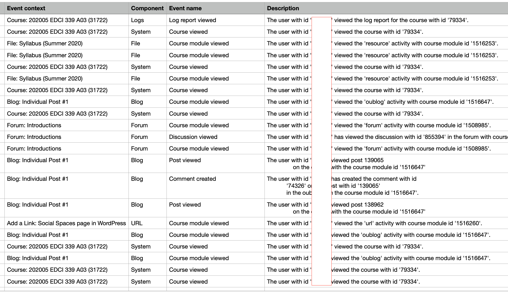

[plugin:content-inject](_important-reminders)

[plugin:content-inject](_writing-prompt)

Topic 3 expands on the discussions from topic 1 about privacy and also introduces issues of access for minority and vulnerable populations. Open education has always been primarily been about providing increased access to learning for those who may otherwise have been excluded. Confusion between 'open' and 'distributed' learning comes partly from the fact that open education has its roots in distance (or distributed) education and the two both have the same goal of improving access. Today, however, I find it useful to think of 'open' education as being specifically for people who choose to participate in learning experiences because those experiences are made available on the open web, and they do so for their own personal edification, not for credit.

EDCI 339 is an example of a course that is offered in the open on WordPress, and learner interactions are open (unless you have chosen otherwise), so it is an open course. However, if you are a registered UVic learner and are completing EDCI 339 for credit towards your degree, then you are not an 'open' learner. You are learning in a distributed format, and you are paying tuition to do so.

If you told your neighbour or co-worker about this course, pointed them to the :fa-link:[course site](https://edtechuvic.ca/edci339), and they decided to follow along for their own interest, they would be considered an 'open' learner.

Part of the reason we began this course in CourseSpaces is to demonstrate this difference. Topic 1, in CourseSpaces, is a classic 'distributed' model. Access is limited to registered learners, interactions and learner contributions are invisible to the public, and it would be impossible for someone not registered at UVic to participate. Beginning in Topic 2, we opened the course by moving all content and interactions into WordPress. Many of the constraints of the learning management system (LMS - CourseSpaces/Moodle) are gone. Anyone can access the course materials, you are free to share your work with your community, and anyone can follow along for free.

Another reason we chose this model is to demonstrate the extent of the data that is generated when you participate in an LMS-based course. Since the course was created, there have been over 5000 'clicks' within the course. Each of those clicks represents something that either one of you or I did in the course.

The report looks like this:

You can see that I have occluded user ID numbers, and I didn't include the column that shows the names of users. Every time you click on something, CourseSpaces records the click in the database, along with your IP address. Keep in mind that this is only one course and only one week of interactions in the course. So, it is one thing to know that CourseSpaces is keeping this information, but the important thing about CourseSpaces is that it is open source software, which means that there is no company hosting the software that is using that data for their gain.

Canvas is an LMS that has rapidly gained market share in North America. Over the last several months, they have been going through a process to go private after being a publicly-traded company for several years. The initial offer valued the company at [around $2 billion (US)](https://www.edsurge.com/news/2019-12-04-new-ownership-for-an-lms-giant-private-equity-firm-to-buy-instructure-for-2-billion). Given that Canvas is primarily a cloud-hosted LMS, all of the data from 30 million students across North America was suddenly 'for sale' and purchased by a private equity firm.

Open educators often prioritize open platforms (like WordPress) because learner data doesn't go up for sale to the highest bidder, if it is collected at all. When you interact with your own site on opened.ca, you are the one in control of your data.

To bring this back around to access for marginalized and minority groups, we know that platforms which prioritize the gathering of user data (Google/YouTube, Facebook/Instagram, Twitter, TikTok) and then displaying content based on past views have a very strong influence on culture. The algorithms that these tools use prioritize and normalize content created by and for white people, which excludes people from other ethnic backgrounds.

The final component of openness that I will write about today is the ability of all people to *participate* in higher education. I believe that higher ed is fundamentally about 3 things:
- the creation of new knowledge
- sharing new knowledge
- service for the good of the community

These three purposes are at the core of faculty work, with most faculty spending about 40% of their time on each of research and teaching, and the remaining 20% on service. Your role as a learner also reflects these values. You are participating in the process of creating and sharing new knowledge, and doing so is a service to the community. However, if your work is locked behind the login screen of the LMS, how are you contributing? If, on the other hand, your work is open, you are contributing to the community with every post you make.

With all that in mind, the readings for Unit 3 reflect these priorities for open education.

Rissa and Maha - https://www.youtube.com/watch?v=4bjWONvQXY0
