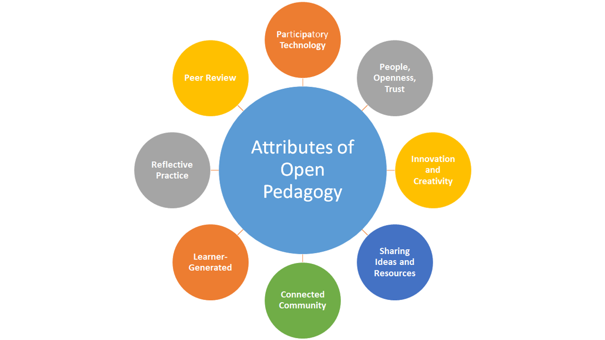

[plugin:content-inject](../unit-06/_important-reminders)

There are two items for you to read in this unit.

:fa-book: *Attributes of Open Pedagogy: A Model for Using Open Educational Resources.*

<a class="embedly-card" data-card-controls="0" href="https://www-jstor-org.ezproxy.library.uvic.ca/stable/44430383?seq=1#metadata_info_tab_contents">EZProxy - Electronic Resource Login</a>

You don't need to read Hegarty's article deeply. You can skim it, but please pay attention to the eight attributes in the following diagram.

Image: [https://wordpress.viu.ca/enhancingpersonalizedlearning/2017/09/12/design-attributes-of-open-pedagogy-by-bronwyn-hegarty/](https://wordpress.viu.ca/enhancingpersonalizedlearning/2017/09/12/design-attributes-of-open-pedagogy-by-bronwyn-hegarty/)

:fa-book: *Textbooks, OER, and the Need for Open Pedagogy*

<a class="embedly-card" data-card-controls="0" href="https://criticaldigitalpedagogy.pressbooks.com/chapter/textbooks-oer-and-the-need-for-open-pedagogy/">An Urgency of Teachers</a>

[Tap here for Blog Post #4](https://teaching.madland.ca/edci339/home/unit-06-post-4?classes=btn,btn-primary)
