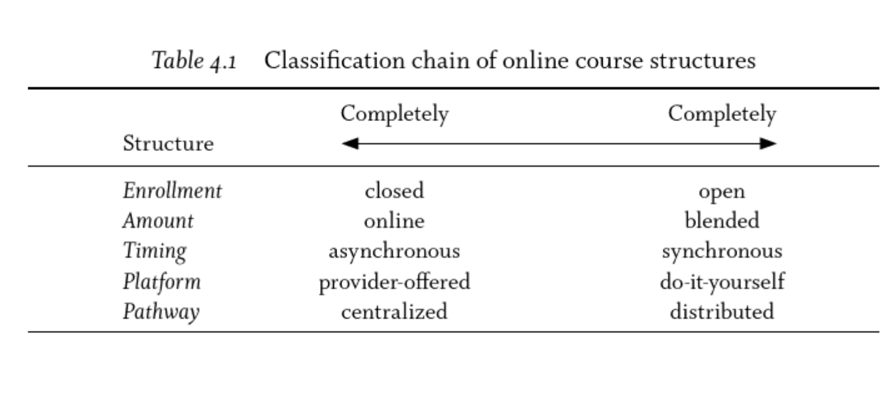
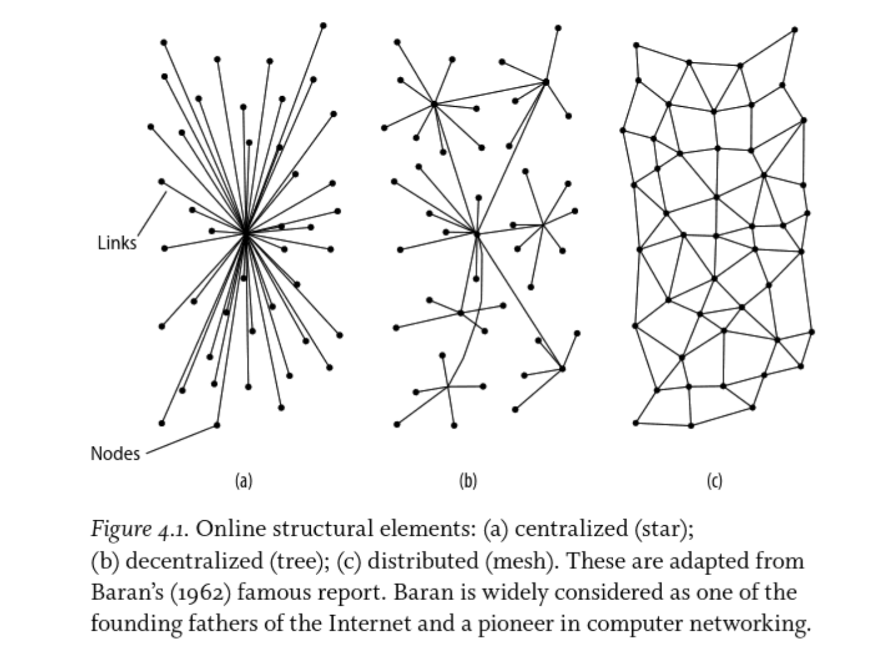

By now you should have signed up for a WordPress site and sent me the URL through the form in the Unit 3 link in the [course hub](https://edtechuvic.ca/edci339).

Once you have done that, it is time to do some reading on the different pedagogy and power structures in online learning.

The book you need to use is available through the UVic Library as an e-book, so, still, there is no need for you to purchase anything.

Please read pages 88-105 in the ebook. You will need to sign in to the UVic library to view the book.

[Click here for assistance with the Library](https://www.uvic.ca/library/use/connect/index.php?classes=btn,btn-primary)

<a class="embedly-card" data-card-controls="0" href="https://ebookcentral-proquest-com.ezproxy.library.uvic.ca/lib/uvic/reader.action?docID=3318874">EZProxy - Electronic Resource Login</a>

While you are only required to read a portion of the chapter, there are some ideas from the rest of the chapter that are relevant.

Major writes about various different structures of online (distributed) courses under the following headings:

### Enrollment

An online course may have either 'open' or 'closed' enrollment. A closed-enrollment course is by far the most common in accredited higher education as well as K-12. EDCI 339 is an example of a closed-enrollment course. In order to participate for credit, learners must be registered through the University of Victoria and paid a tuition fee in order to gain access to the course materials (at least Units 1-2), have their work assessed by an instructor (me), and receive 1.5 units towards their degree program.

On the other hand, an open-enrollment course is available for anyone who has reasonable access to the internet to participate. The catch with open-enrollment courses is that they generally do not count towards a degree program because learners won't receive individualized feedback or assessment from an instructor. An example of an open-enrollment course that you can explore is [Anthropology 101](https://anth101.com) offered by Michael Wesch at Kansas State University. also, EDCI 339, (after unit 2) is an open-enrollment course. anyone with the link to [edtechuvic.ca/edci339](https://edtechuvic.ca/edci339) can follow along and participate, but they wont' get UVic credit.

That means that your family and friends can follow along too!

### Amount

There are degrees of 'online' in many courses. Some courses that you take at UVic will be fully onsite where you are obligated to attend a particular room at a particular day and time in order to participate. Sometimes, those courses will be 'blended' with some online experiences, such as quizzes and discussion forums that you need to complete in order to be successful. And, like EDCI 339, some courses are fully online, where there are no required meeting `places`, even though there may be scheduled meeting `times` through web technologies.

### Timing

Another structural element that is relevant to the conversation is that of the timing of the course. An onsite course is typically considered 'synchronous' where everyone meets at the same time. EDCI 339, is mostly 'asynchronous' where you, as learners, can engage with the course on your own time, even though there is a set schedule of due dates. A purely asynchronous course would not have any start and end dates or due dates. Learners can engage whenever they want and can take as long as they want to complete.

It used to be that distributed learning happened through the postal system, so there might be several weeks between learners submitting their work and subsequently receiving feedback from their instructor.

### Platform

The platform used by a course also determines much of the structure. So far in this course, the platform has primarily been the Learning Management System (LMS) CourseSpaces (which is actually Moodle). That platform, like all LMSs requires a very specific course structure. Think of the way that the course is built, with a long list of separate files and activities, and the structure of a discussion forum (remember that 45 minute delay after posting?). This is a 'provider-offered' solution where you and I have very little control over the interface and functionality.

Now we've moved to WordPress and there are a whole new set of possibilities and constraints. We can now have a decentralized or distributed model (see 'Pathway' next), where learners are doing their work on their own sites and syndicating to a course hub. That model of course would be extremely difficult to do in Moodle or Blackboard due to the specific structure of LMSs, which were built to replicate and support onsite classes. This 'do-it-yourself' model gives you and I much more control over what our sites look like and how we interact with them. In fact, the work that I am doing on this post isn't even in WordPress, it's in Grav, an unrelated system. Any one of us could choose to use any number of systems like WordPress, Grav, Known, Ghost, Medium, or even Tumblr (but nobody likes Tumblr).

Also, with WordPress, you can choose from tens of thousands of free themes and just as many paid themes as well as plugins to extend the functionality of your site. None of this is possible in an LMS.

### Pathway

There are three primary pathways that Major identifies: centralized, decentralized (tree), and distributed (mesh).

A centralized course is like a typical LMS course where all of the control is centralized and there is a very prescribed pathway through the material. Unit 1-2 of EDCI 339 was centralized. You had very little control over how to engage with the course.

Now in WordPress, your options are greater, and the control has been decentralized, especially since you have identified learning pods and partners. Instead of everything going through me and CourseSpaces, you can choose how to interact with your pod (although I strongly suspect you have plenty of connections outside of CourseSpaces anyways). you can go to Twitter, WhatsApp, or WeChat...chances are slim you're in Facebook though. Ideally, if this course and community were to continue, your control would increase, mine would decrease, and we would end up in a fully distributed model. It's hard to get there though.

Recall this notice:

[plugin:content-inject](_class-preparations)

## Blog Post 1 Details

After reading Claire Major's chapter, your task is to go find examples of digital web tools that support different modalities of online learning as described in Major's five headings. There are several tools described in the reading and many more in the whole chapter.

In a post on your own blog, describe two or three tools and how they support different modalities. If you have personal experience with a particular tool for learning, even informally, please share that as well along with your own reflections.

You are encouraged to work together with your learning pod, but each of you should describe different tools.

Your post should be 300-500 words and must use the category `Distributed & Open Learning` as it is on your opened.ca site.
