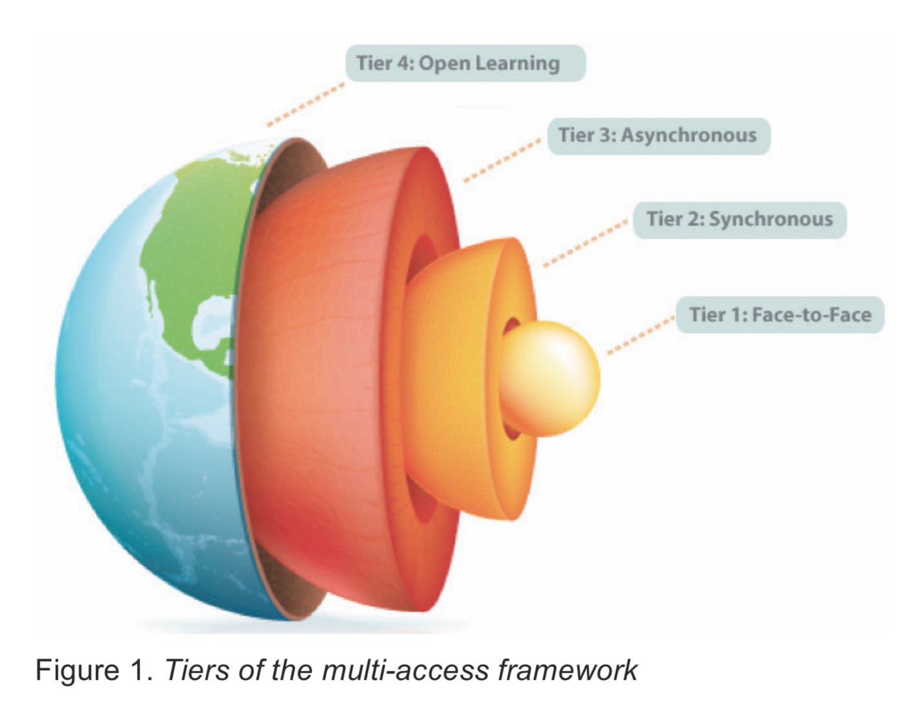

Another way to think about modalities is to think about how learners are able to access learning opportunities. While onsite learning requires learners to be in a certain place at a certain time, online learning requires learners to have access to a computer and a reliable internet connection. There are people who will be excluded regardless of which modality is offered. The same is true for each of the five headings in Major's chapter from your reading.

<a class="embedly-card" data-card-controls="0" href="https://ebookcentral-proquest-com.ezproxy.library.uvic.ca/lib/uvic/reader.action?docID=3318874">EZProxy - Electronic Resource Login</a>

One way to mediate that problem is to offer multiple access points for learners in what UVic's Dr. Valerie Irvine calls `multi-access learning`. You aren't required to read this article, but it is here for reference.

<a class="embedly-card" data-card-controls="0" href="http://jolt.merlot.org/vol9no2/irvine_0613.pdf">Card</a>

The basic idea is that institutions can give more control and agency to learners by increasing the ways that learners can access learning environments.

At the core of the model is the onsite (face-to-face) model where learners all meet in a central location at the same time to hear from the instructor and to interact with each other in various activities. However, that excludes potential learners who are unable to attend a central campus, so Irvine offers the possibility for learners to connect with the onsite cohort through video conferencing. This second tier, or cohort, of learners is meeting synchronously, but entirely online removing geographical barriers to participation.

However, even that excludes learners who might not be able to meet at a particular time **or** place. Many learners in EDCI 339 are engaging from China, so meeting times would be difficult, even if the possibility exists of connecting through web-conferencing. For this third tier of learners, Irvine offers the possibility to view a recording of the class at a later time, and still via online web-conferencing.

Finally, the final tier of access is for open enrollments; learners who would like to engage with the course but who do not require accreditation.

Irvine's model touches on all five of Major's elements of the structure of a distributed course, while at the same time, allowing for learners to exercise agency and control over how they engage.

### References

Irvine, V., Code, J., & Richards, L. (2013). Realigning higher education for the 21st-century learner through multi-access learning. *Journal of Online Learning and Teaching, 9*(2). Retrieved from [http://jolt.merlot.org/vol9no2/irvine_0613.htm](http://jolt.merlot.org/vol9no2/irvine_0613.htm)

Major, C. H. (2015). *Teaching online: A guide to theory, research, and practice.* Baltimore, Maryland: Johns Hopkins University Press.
