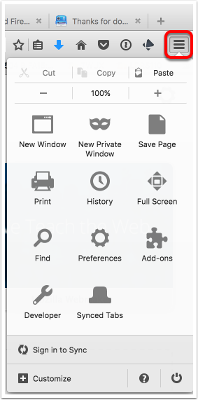
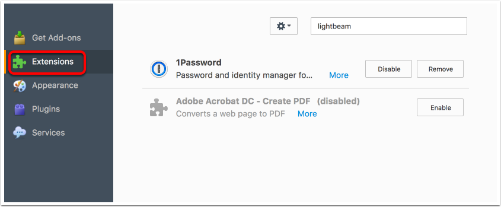
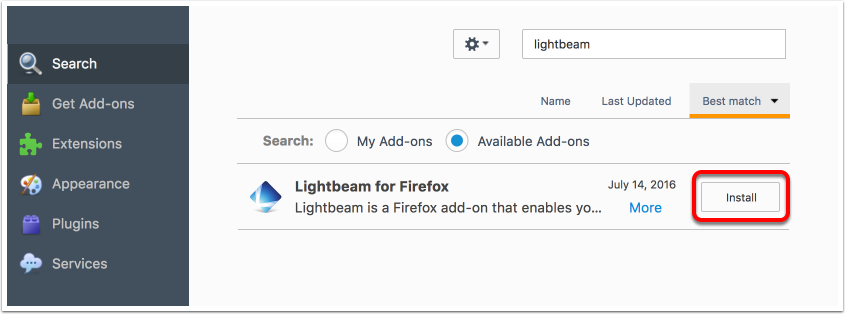
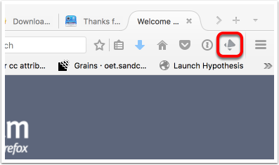

[plugin:content-inject](_important-reminders)

##### Protecting Yourself

One of the first things that you should do to protect yourself online is to consider how you are protecting your own data and information. Many websites require that you sign in before you can fully participate in the site. This allows the owner of the site to track who you are and what you do on their site. Popular sites generate enormous amounts of data on you and your online activities, and that may not really concern you. Many people think that they have nothing to hide, so they have nothing to worry about.

Consider the following video.

[plugin:youtube](https://youtu.be/33CIVjvYyEk)

Keep in mind that if the site that you are using is 'free', then the site and its services are not the product; you are the product. Your online habits are being scrutinized and subsequently bought and sold so that the original site and sites that purchase your data can more effectively sell you things.

##### Tracking the Trackers

Here is another video for you to consider.

[https://www.ted.com/talks/gary\_kovacs\_tracking\_the\_trackers](https://www.ted.com/talks/gary_kovacs_tracking_the_trackers)

For this activity, you will need to be using Mozilla's Firefox web browser. [You can download and install Firefox here.](https://www.mozilla.org/en-US/firefox/new/?scene=2)

Once you have launched Firefox,

##### Install Lightbeam

###### Go to 'Add-ons'

Click the 'hamburger' in the top, right corner of Firefox.

###### Click 'Extensions' and enter 'lightbeam' in the search window.

###### Install

###### Activate

Click the Lightbeam icon in your toolbar.

###### Think

Now that you have Lightbeam activated in Firefox, you'll be able to see exactly who is tracking you as you interact on the web. Spend some time visiting sites that you would normally visit, and periodically check in on the Lightbeam tab in Firefox to see what sites are most active. Keep LightBeam active for a few days and check in every once in a while.

##### What can websites learn about you?

You might know that websites track you, but do you know how much information they gather?

For this next activity, make sure your computer (the site you will visit isn't optimized for mobile devices) is not muted (you might want to use headphones) and visit https://clickclickclick.click.

###### Reflect

Create a new post on your blog and write a little bit about what you noticed using LightBeam and visiting https://clickclickclick.click. Some questions you might want to consider are:

* which site that you visited had the most trackers?
* how many of the trackers came from sites that you did not visit?
* how long does your normal browser keep cookies from third parties?
* did the amount of data gathered at https://clickclickclick.click surprise you?
* [Your own questions or observations.]
