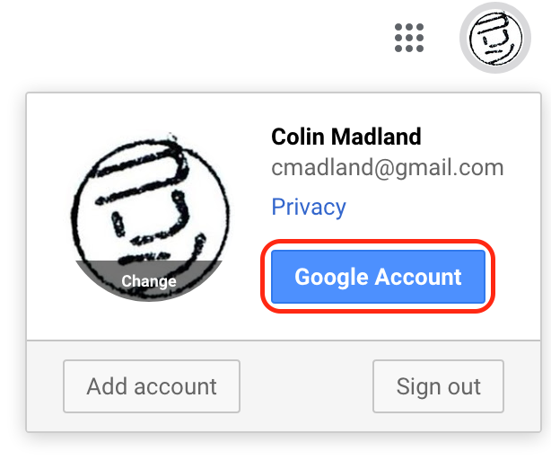
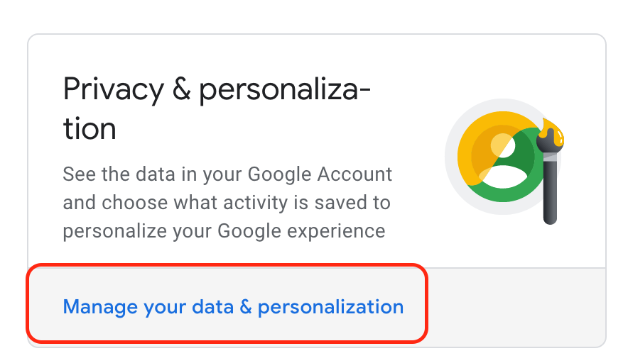
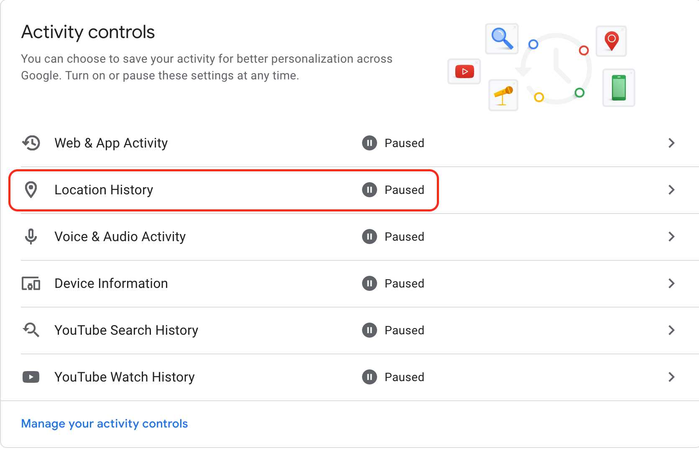
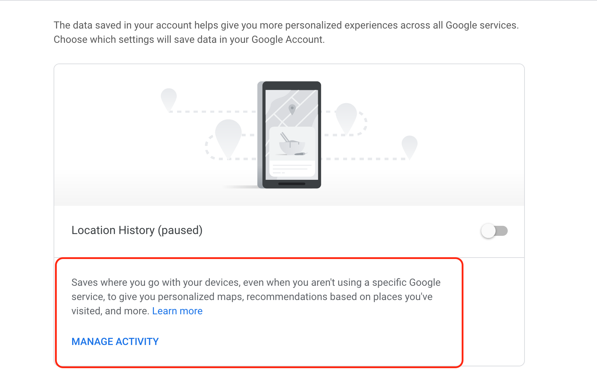

[plugin:content-inject](_important-reminders)

##### Protecting Yourself

One of the first things that you should do to protect yourself online is to consider how you are protecting your own data and information. Many websites require that you sign in before you can fully participate in the site. This allows the owner of the site to track who you are and what you do on their site. Popular sites generate enormous amounts of data on you and your online activities, and that may not really concern you. Many people think that they have nothing to hide, so they have nothing to worry about.

Consider the following video.

[plugin:youtube](https://youtu.be/33CIVjvYyEk)

Keep in mind that if the site that you are using is 'free', then the site and its services are not the product; you are the product. Your online habits are being scrutinized and subsequently bought and sold so that the original site and sites that purchase your data can more effectively sell you things.

##### Tracking the Trackers

Here is another video for you to consider.

<iframe src="https://embed.ted.com/talks/gary_kovacs_tracking_the_trackers" width="854" height="480" style="position:absolute;left:0;top:0;width:100%;height:100%" frameborder="0" scrolling="no" allowfullscreen></iframe>

##### LightBeam
For this activity, you will need to be using Mozilla's Firefox web browser. [You can download and install Firefox here.](https://www.mozilla.org/en-US/firefox/new/?scene=2)

Once you have launched Firefox,

##### Install Lightbeam
Lightbeam grew out of the Collusion project.

###### Go to 'Add-ons'

Tap the 'hamburger' in the top, right corner of Firefox.

###### Tap 'Extensions' and enter 'lightbeam' in the search window.

###### Install

###### Activate

Tap the Lightbeam icon in your toolbar.

###### Think

Now that you have LightBeam activated in Firefox, you'll be able to see exactly who is tracking you as you interact on the web. Spend some time visiting sites that you would normally visit, and periodically check in on the LightBeam tab in Firefox to see what sites are most active. Keep LightBeam active for a few days and check in every once in a while.

##### What can websites learn about you?

You might know that websites track you, but do you know how much information they gather?

For this next activity, make sure your computer is not muted (you might want to use headphones) and visit https://clickclickclick.click.

##### What does Google know about you?

Google Apps for Education (GAFE) is *very* popular in K-12 contexts in BC, and there is an assumption on the part of teachers and districts that it is 'safe' because Google doesn't use data from GAFE to serve ads to learners. Well, [Bill Fitzgerald has some ideas on that.](https://funnymonkey.com/2015/where-the-sidewalk-ends-wading-through-googles-terms-of-service) You don't need to read that whole article, but may want to keep it in mind.

##### Here is how you can see what Google has on you.

###### Sign in to Google (if you have an account, don't create one for this activity)

###### Hover over your avatar in the top right, and click 'Google Account'

###### Tap 'Manage your data and personalization'

###### Tap 'Location History'
! Notice that all of my activity is 'Paused'? I strongly recommend you do the same.

###### Tap 'Manage Activity'

#### Some questions for you...
You can use these questions to inspire Blog Post #2 if you want, but that is not required.

:fa-question: What do you think?   
:fa-question: Does the fact that Google (possibly) has that much information about your location for any given day concern you?  
:fa-question: Should we tell K-12 learners that they can trust Google by normalizing the use of Google Apps?
:fa-question: Should we use this data to predict which learners are at-risk?  
:fa-question: Does collecting data **put** students at risk?  

[Next Page](https://teaching.madland.ca/edci339/home/unit-04-tracking?classes=btn,btn-primary)
