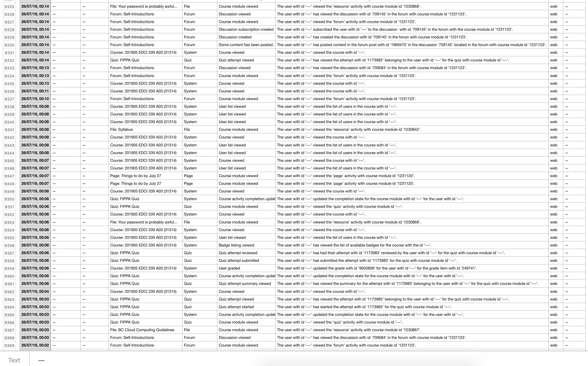

[plugin:content-inject](_important-reminders)

[plugin:content-inject](_class-preparations)

Ok, we are cruising along through this world of distributed learning! We've read a bit about privacy and the provincial regulations in BC called FIPPA, we considered different modalities of distributed learning, and then went looking for tools that might support different modalities. Thank you for your work on all that!

For the next couple of days, we need to start integrating our knowledge of FIPPA with the nature of the tools that we use for learning. You hopefully know that there is a reason that the BC government requires public bodies to protect the data and information of our citizens, whether they are learners in K-12, like you in higher ed, or patients in our hospitals.

You hopefully know that the websites that we all visit gather large amounts of data about what we do online. Some sites use that data to improve their services, others to provide recommendations on what else we might like based on our past behaviour, and others sell that data to other companies to do what they want. Unfortunately, this isn't restricted to commercial sites like Twitter, Facebook, Reddit, and the like. Educational technology companies do it too.

I've mentioned previously that CourseSpaces is actually UVic's name for an LMS called Moodle. I decided to see what data has been gathered about EDCI 339 and the users who access it (Moodle doesn't differentiate between students and instructors, everyone is a user).

In a couple of clicks (maybe 4 or 5) I was able to download a spreadsheet of everything that has happened in the EDCI 339 course site since it was created at 4:28 PM, Pacific Standard Time, on April 24, 2019 until this morning at 10:52 AM July 31, 2019. Between those two times, there were exactly 10,000 'hits' or events that occurred in the site. Every single click by every single user was recorded and stored in a database. Unsurprisingly, the vast majority of those hits have happened in the last five days since the course officially began.

Below is a screenshot of a tiny portion of that spreadsheet from the very beginning of the course.

On the very left side, you can see the row numbers on the spreadsheet, then the date and time, followed by two columns that are redacted. These two columns are the names of the user and the affected user (if I grade your paper, I am the user, and you are the affected user). Moving across from there you can see which course this happened in, what occurred, in what part of the course, and who was involved. I've also redacted the ID numbers associated with each user. On the far right is another redacted column that displays the IP address of the user (this could allow someone to track a user's physical location).

As you can see from the spreadsheet, about 94% of the data in this sheet was generated over the last five days.

I would like for you to come out of this unit with two primary skills:

1. You should be able to protect your own web data.
2. You should be able to choose software that respects learner data.

[Tap here for Unit 4 learning activities](https://teaching.madland.ca/edci339/home/unit-04-tracking?classes=btn,btn-primary)
