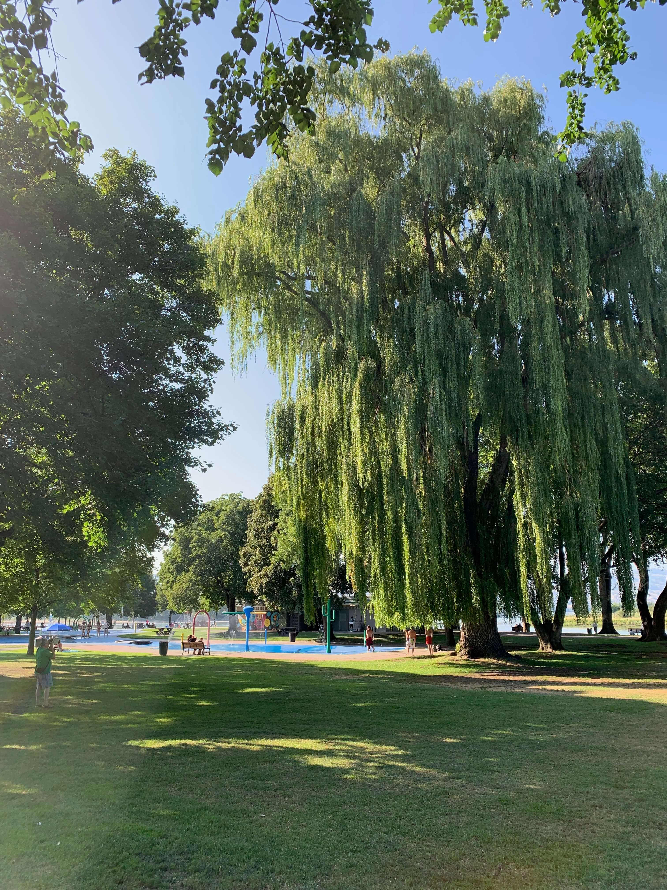

[plugin:content-inject](_class-preparations)  
[plugin:content-inject](_important-reminders)  

As we enter the final week of EDCI 339, you will be given opportunity to think more deeply about what we've been talking about so far, and to practice some of the open and public scholarship that can be enabled with modern web tools. We started the course in a very stereotypical way in Moodle with an objective quiz, and relatively tightly restricted forum post, but since then we have moved into WordPress, worked through some digital literacies required to register for and host a blog, introduced Hypothes.is as a tool for annotating the web, Slack as a backchannel for conversations around the course. I've offered to meet with anyone either through BlueJeans, but nobody has taken me up on that yet.

Here's a shameless plug...

[plugin:content-inject](_class-preparations)

A few of you have called me to talk about the course and plan around your summer schedules, and yesterday, while I was just finishing up a run and swim in Riverside Park in Kamloops (here's a picture to make you jealous), one of you called to talk about integrating some of these ideas into their practice as a teacher this fall!

And here's my run, if you're interested...

<a class="embedly-card" data-card-controls="0" href="https://www.strava.com/activities/2599886934">Afternoon Run - Colin Madland's 5.0 km run</a>

Anyways for the next couple of days, we are going to have a conversation about the history and future of Educational Technology as related to distributed and open learning, according to Tony Bates.

The [Educational Technology Users Group (eTUG)](https://etug.ca) is a group of educational technologists and interested faculty in BC and has been meeting once or twice a year to talk and learn from each other about how to integrate technology into learning in higher ed in BC. This past June was the 25th anniversary of the eTUG conference and Tony Bates was there as one of the presenters. After the conference, he published a review of the conference as well as a bit about the history and future of EdTech in BC.

### Annotating the Web

If you haven't already done so, please [register for Hypothes.is](https://teaching.madland.ca/hypothesis) and [join the `edci339-summer19` group by clicking on the invite link on this page](https://edtechuvic.ca/edci339/links).

!! Please remember that hypothes.is is hosted in the US and your data will be sent to servers there. You may choose to not register, or to sign up under a pseudonym.

For this activity, you are encouraged to post to 'Public', although you do have the option of posting to the edci339-summer19 group if you prefer more privacy. If you post to 'Public', please use the tag `edci339` so everyone can find your comments.

As you read Tony's post, please make comments and ask questions as you go. As usual, you shouldn't summarize the post (there's no need as the post is right there!), but you should make connections to what we have talked about in the course, and what `you` find to be important. Make connections to your own experience.

[Tap here for 'Showcase Post'](https://teaching.madland.ca/edci339/home/unit-07-showcase?classes=btn,btn-primary)

---
