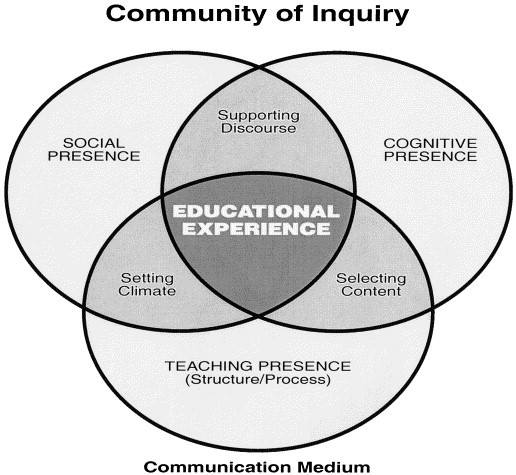
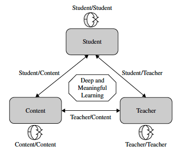
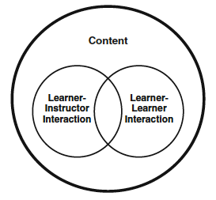
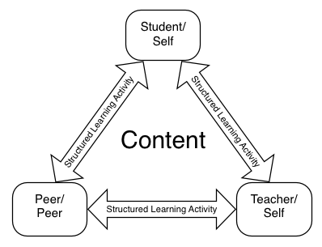

[plugin:content-inject](_checklist)

# Learning in Community

## Overview

Welcome to LDRS 663 - _Coaching for Transformational Blended Learning_! In this first unit, we will begin by considering the nature of learning communities through the lens of a model called the _Community of Inquiry (CoI)_ ([Garrison et al., 2000](https://www.sciencedirect.com/science/article/pii/S1096751600000166?); [Vaughan et al., 2013](http://www.aupress.ca/index.php/books/120229)). The CoI model proposes that there are three overlapping components, or presences, to any learning environment; cognitive presence (constructing meaning), social presence (projecting a sense of yourself), and teaching presence (designing and facilitating the learning experience). The CoI model is grounded in a long history of social constructivism which is the idea that learning is fundamentally a social process ([Dewey, 1897](https://en.wikisource.org/wiki/My_Pedagogic_Creed); [Vygotsky, 1978](https://ezproxy.student.twu.ca/login?url=http://search.ebscohost.com/login.aspx?direct=true&db=cat05965a&AN=alc.191437&site=eds-live)). We will also consider various modes of interaction in learning environments and how these two models have informed the model of teaching and learning in TWU FAR Centres.

## Topics
This unit is divided into 3 topics:

1. Introduction to the Community of Inquiry Model

2. Modes of Interaction

3. Interaction Equivalency Theorem

## Learning Outcomes
When you have completed this unit you should be able to:

- Analyze the characteristics of the Community of Inquiry model.
- Evaluate different modes of interaction.
- Criticize the Interaction Equivalency Theorem.

## Resources
Here are the resources you will need to complete this unit:

Garrison, D. R., Anderson, T., & Archer, W. (2000). Critical inquiry in a text-based environment: Computer conferencing in higher education. *The Internet and Higher Education*, 2, 87-105. doi:10.1016/S1096-7516(00)00016-6 - This article is accessible through the [TWU Library](http://www.twu.ca/library).

Vaughan, N., Cleveland-Innes, M., & Garrison, D. (2013). _Teaching in blended learning environments: Creating and sustaining communities of inquiry._ Athabasca: AU Press. - This book is available for free at [AUPress](http://www.aupress.ca/index.php/books/120229).

[ui-accordion independent=true open=none]
[ui-accordion-item title="Topic 1: Introduction to the Community of Inquiry Model"]
#### Introductions
Before we get going, please take a few moments to post an introduction to yourself in the 'Introductions' forum in Moodle. Add an image to the top of your post which communicates the idea of 'Community' and a short explanation for your choice.

Before you dive into the content of this first unit in LDRS 663, take a moment to recall some particularly memorable learning experiences that you have had. They don't have to be particularly profound in terms of *what* you learned, but profound because of the fact that you still remember *that* you learned something and *how* you learned it. Pick one or two of those experiences and share them in your introduction. Make sure to tell us about the context of your experience. Who was there? What did you do to learn? Why do you remember it? Take a few moments to read some of your colleagues' posts as well.

#### Social Constructivism

There is a very good chance that the posts you read as part of the previous learning activity included a description of some sort of social interaction. This isn't always the case, but the idea that learning is a social process has a long history in education. Many theorists credit John Dewey for bringing this idea to the forefront of educators' minds. In his 1897 treatise *My Pedagogic Creed* he writes:

> I believe that the school is primarily a social institution. Education being a social process, the school is simply that form of community life in which all those agencies are concentrated that will be most effective in bringing the child to share in the inherited resources of the race, and to use his own powers for social ends. (p. 7)

The idea didn't originate with Dewey, though, as we know that in first-century Palestine there was a certain itinerant teacher whose lessons were profoundly impactful on a small group of young men and women who were called to live and learn in a deeply personal and social community.

Following Dewey, many others, such as Jean Piaget, Jerome Bruner, and Lev Vygotsky (see [Driscoll, 2005)](https://ezproxy.student.twu.ca/login?url=http://search.ebscohost.com/login.aspx?direct=true&db=cat05965a&AN=alc.1254633&site=eds-live) have written about what has now become known as the educational theory of *social constructivism*, or, more concisely, constructivism. Driscoll (2005) describes constructivism as a theory that
> rests on the assumption that knowledge is constructed by learners as they attempt to make sense of their experiences. Learners, therefore are not empty vessels waiting to be filled, but rather active organisms seeking meaning. (p.387)

This process of seeking meaning is an iterative process whereby the learner experiences some sort of cognitive dissonance, or a disconnect between what they previously knew and some new piece of evidence or experience that disconfirms that knowledge. The learner then seeks to resolve that dissonance by either incorporating the new experience into an older schema, or by disregarding one or the other. Most often, the resulting knowledge is constructed from portions of both the new and old idea.

#### Community of Inquiry

This brings us to the idea of a 'Community of Inquiry' (CoI), which was first described by Garrison, Anderson, and Archer in their 2000 article "Critical Inquiry in a text-based environment". Garrison, et al. theorize that there are three critical components, or "presences" that compose an interactive, online learning environment: Cognitive presence, social presence, and teaching presence. The intersection of these three presences is the heart of an educational experience.

##### Cognitive Presence
Cognitive presence, possibly the most foundational element, is the
> extent to which the participants in any particular configuration of a community of inquiry are able to construct meaning through sustained communication (p. 89).

Recall that this cognitive process is at the heart of constructivist learning environments. It seems obvious (be careful when people say that) that this construction of meaning through communication is the entire point of higher education. Your task as a student is to change your own mind, and that is a very tall order as our beliefs about many things are remarkably resilient. The way we engage in this task will have a significant bearing on the outcomes of the task.

If we approach communication with too much confidence in our own views, we can shut out competing ideas to our own detriment, so it is important to bring a cautious intelligence, or, as I once heard a student describe it, epistemic humility. We all know that we are wrong about some things. The trouble is we don't know what we are wrong about and how we have misunderstood.

Cognitive presence in a text-based environment (like an online course) carries with it some affordances, but also some disadvantages. It is a relatively common experience for people to type something in a text message or an email, only to have their intentions grossly misunderstood because there are fewer para-linguistic cues in text compared to verbal face-to-face communication. Recent developments in incorporating emojis have started to change this, but emojis are generally considered to be too informal for 'serious scholarly work' or written professional communication. So, the relatively lean environment of text can lead to significant misunderstandings.

On the other hand, for learners like me who tend toward introversion, the asynchronous nature of text-based learning environments is a huge advantage. I couldn't count the number of times that I have wanted to contribute to an in-class discussion, but needed too much time to formulate a coherent response, and before I knew it, the conversation had moved on. My point was no longer relevant, having been resolved by those in the class who were more extroverted and ready with an answer. A text-based environment, however, gives me *time to think, write, revise, and then post* my response.

##### Social Presence
Garrison, et.al. describe social presence as
>the ability of participants in the Community of Inquiry to project their personal characteristics into the community, thereby presenting themselves to the other participants as “real people.” (p. 89)

In any community, and especially the TWU community, the ability to *belong* and to be accepted as a whole and integrated person is critical to people feeling like they *actually do belong*. It is for this reason that many experienced online educators encourage a more colloquial style of writing in online forums or blogs. Strict adherence to APA or other style guides virtually eliminates self-referential language such as personal pronouns. It is hard to project your personal characteristics as a real person when you can only refer to yourself in the third person.

By allowing a more personal style and the projection of self into the community, it is thought that students will build a sense of trust in the community and feel more empowered to participate in the difficult work of changing their minds. Social presence supports cognitive presence by allowing the learning environment to be safe and welcoming.

##### Teaching Presence
This final element of the CoI model is the design and facilitation of the learning experience
>to support and enhance social and cognitive presence for the purpose of realizing educational outcomes. (p. 90).

Teaching presence can be a shared function between members of the community. Garrison, et al. point out that the design of the experience is typically performed by the teacher, and the facilitation is more often shared. In a connected course like this one, there is a greater emphasis on shared facilitation in a community of learners compared to what might be experienced in a f2f (face to face) course. It is in this shared discourse in a safe environment that allows learners to engage in the difficult cognitive work of learning.
[/ui-accordion-item]

[ui-accordion-item title="- Learning Activity"]
 
:fa-book: Read [Critical inquiry in a text-based environment: Computer conferencing in higher education](https://www.sciencedirect.com/science/article/pii/S1096751600000166) (access through the TWU library).

If you haven't done so previously, sign up for and activate hypothes.is and while you are reading the article, leave some annotations that connect what you are reading to your own experience.

Use the tag 'ldrs663' in any annotations you create so that we can all find each other.

[Click here for assistance getting set up with hypothes.is.](http://create.twu.ca/help/other-web-tools/hypothesis)

As you read, consider a time where you experienced a learning environment where the three presences described in the CoI were apparent. Consider the following questions and consider writing your responses in a learning journal.
  - Were all three presences demonstrated?
  - Which of the three were most obvious? Least?
  - Which presence is most important for you?

Note that this is an ungraded activity, but is designed to help prepare you for the assessments in this course.  Throughout the course you are encouraged to take notes in a journal of some sort. Refer to these notes as you complete your assessments.
[/ui-accordion-item]

[ui-accordion-item title="Topic 2: Modes of Interaction"]
For this next topic we will look at what we mean by 'interaction', a word which is thrown around a lot in educational technology, but...

[plugin:youtube](https://youtu.be/G2y8Sx4B2Sk)

Before we get into the the topic of interaction, please take a few minutes to answer the following questions about scenarios that may or may not be considered 'interaction'.
(Note that you can check your answer right away, and then click the arrow for the next example.)

[h5p id="2"]

What do you think? Do you agree with the 'correct' and 'incorrect' responses on the quiz?

### Interaction
Anderson (2003) argues that, despite the lack of clarity around definitions of interaction, there seems to be a general understanding that interaction of some sort is a requirement for learning. He settles on the definition from Wagner (1994, p.8)

!!!! reciprocal events that require at least two objects and two actions. Interactions occur when these objects and events mutually influence one another.

He provides a model of interaction in learning environments that includes three main agents in the process: students, teachers, and content (Figure 1).

###### Figure 1. Modes of Interaction from Anderson (2003).

At each point of the triangle are the agents in an educative process. The arrows between them indicate the two-way communication described by Wagner, and the recursive arrows above or below the agents are secondary forms of interaction.

### Other Models of Interaction
Kanuka (2011) describes a modified model of interaction which presumes that all educational interactions occur in the context of some sort of content (Figure 2.).

###### Figure 2. Modes of Interaction from Kanuka (2011).

In Anderson's model, content is an agent in the process, but in Kanuka's model, content of some sort is assumed to be the foundation of learning environments and that interactions between and among learners and instructors happens in the context of making sense of the content. The content itself does not have agency.

A combination of these two models was described by Madland (2014). Madland's model, shown in figure 3, is a return to Anderson's three-sided model except with the addition of peer interactions, and all interactions between agents occuring in the context of the content that is to be learned. Also added are the three sides of the model representing structured learning activities designed specifically to enhance the educative effects of the interactions.

###### Figure 3. Modes of Interaction from Madland (2014).

!!! Madland, C. (2014). *Structured student interactions in online distance learning: Exploring the study buddy activity* (Master’s thesis, Athabasca University). Retrieved from [http://hdl.handle.net/10791/47](http://hdl.handle.net/10791/47)

It is not enough to simply expect interactions between learners and instructors to be goal-oriented towards learning outcomes. Educators must design specific activities (teaching presence) to create the conditions (social presence) for learning to occur (cognitive presence). An example of this can be seen in the seemingly ubiquitous 'Group Project' assigned in so many undergraduate courses. Sometimes, groups are allowed to form themselves, other times, the instructor assigns groups, or there is some sort of random process to create groups. However they are formed, groups too often fall into a pattern of behaviour where one or two of the students do most of the work and the remaining group members engage in social loafing and benefit from their peers' work.

An alternative practice is to engage groups in a specific structured process of cooperation where everybody must do their work, or else the entire group suffers. An example is to have students work in peer review partners where students submit their assignments to their peer review partner who then provides feedback based on specific questions and categories of comments. When the original students receives their partner's feedback, they may choose how to integrate the suggestions into the final assignment that they submit to their instructor. Each student is then graded on the quality of their finished assignment, the quality of the feedback that they provided, and on the rationale for how they incorporated the peer review into their own work.

There are myriad structures that can be used to ensure that interactions are inclined towards producing student learning, and we will introduce you to some of those in unit 5.

[/ui-accordion-item]
[ui-accordion-item title="- Learning Activity"]
 
#### :fa-book: Read
Read the following article by Terry Anderson
- [Getting the mix right again: An updated and theoretical rationale for interaction](http://www.irrodl.org/index.php/irrodl/article/view/149/230)

As you read, consider what interactions you have experiences in online or f2f courses.
[/ui-accordion-item]

[ui-accordion-item title="Topic 3: Interaction Equivalency Theorem"]
For our last topic of this unit, we'll explore Anderson's (2003) *Interaction Equivalency Theorem*, stated as

!!!! Deep and meaningful formal learning is supported as long as one of the three forms of interaction (student–teacher; student-student; student-content) is at a high level. The other two may be offered at minimal levels, or even eliminated, without degrading the educational experience.
!!!! High levels of more than one of these three modes will likely provide a more satisfying educational experience, though these experiences may not be as cost or time effective as less interactive learning sequences. (p. 4)

At TWU, there has always been a significant emphasis placed on student-teacher interactions. This can be seen in small class sizes and opportunities for students to be involved in faculty-led research projects and travel studies. Distance education, however, has long suffered from a distinct lack of student-teacher and student-student interactions. For many years, distance education was delivered either through the post or through one-way media such as radio or TV, virtually eliminating interactions. This led to a pervasive view that distance education courses and programs were second-rate at best.

However, now that modern communication infrastructure has developed to the point that media-rich, synchronous, two-way communication is almost free, opportunities for distance learning environments to include high levels of student-student and student-teacher interaction are much more feasible.

One problem remains, though, and that is that student-teacher interaction is a scarce commodity. It is costly to hire enough faculty to enable one-on-one or small-group interaction between students and faculty. The distance educator's response to this challenge is to front-load the faculty input (high-level disciplinary expertise or cognitive presence) into the course materials and to de-couple 'interaction' from both time and place.

In an asynchronous, text-based environment, students and teachers do not need to be present in the same place at the same time in order to enjoy rich interactions.

[/ui-accordion-item]

[/ui-accordion]

#### Unit 1 Assessment

Please complete the assignment under 'Post 1' below. This will be your first of five draft posts during the course.

[plugin:content-inject](../assignments/_blog)

## References

Anderson, T. (2003). Getting the mix right again: An updated and theoretical rationale for interaction. *International Review of Research in Open and Distance Learning,* 4(2), 1–14.

Dewey, J. (1897). *My pedagogic creed.* In M. S. Dworkin (Ed.), *Dewey on education.* NewYork, NY: Teachers College Press.

Driscoll, M. P. (2005). *Psychology of learning for instruction* (3rd ed.). Boston: Pearson Education.

Garrison, D. R., Anderson, T., & Archer, W. (2000). Critical inquiry in a text-based environment: Computer conferencing in higher education. *The Internet and Higher Education, 2*, 87–105. https://doi.org/10.1016/S1096-7516(00)00016-6

Kanuka, H. (2011). Interaction and the online distance classroom: Do instructional methods effect the quality of interaction? *Journal of Computing in Higher Education,* 23(2), 143–156. https://doi.org/10.1007/s12528-011-9049-4

Madland, C. (2014). *Structured student interactions in online distance learning: Exploring the study buddy activity* (Master’s thesis). Athabasca University. Retrieved from http://hdl.handle.net/10791/47
