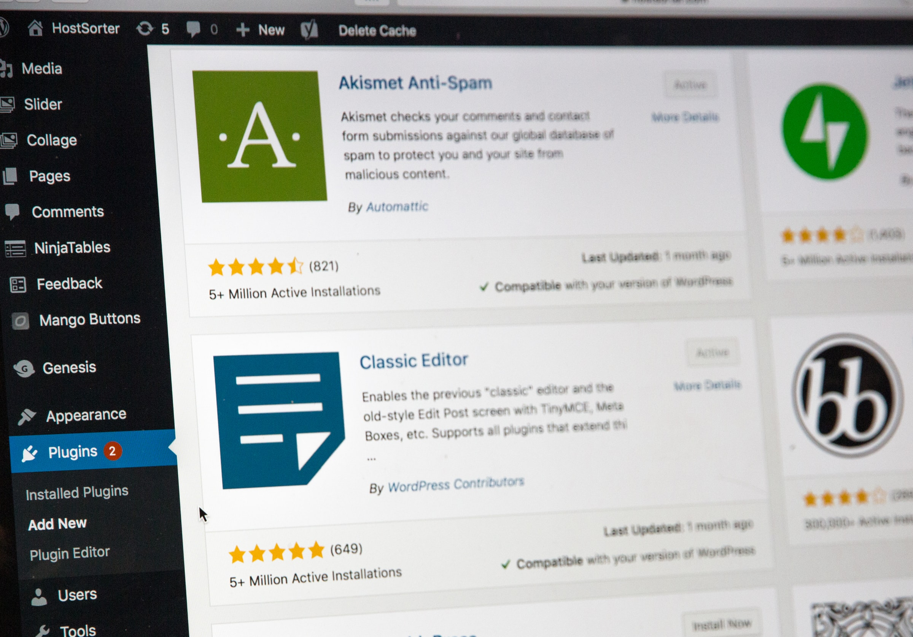

[plugin:content-inject](_checklist)
### Overview

Over the next two weeks, we will introduce you to some background thinking about educational technologies. There are countless companies vying for attention in the edtech field, and they are not all educationally beneficial. In fact, some are outright harmful. We believe that it is important for you to begin to think about how your data are used when you interact with edtech tools and that it is important for you to develop some skills and competencies in building your own domain on the web. With this knowledge, you will be more prepared to spot the nefarious actors and to take control of how you present yourself online.

### Topics

1. Situating yourself online
2. Data and Privacy
3. Subverting surveilance capitalism

### Outcomes
- you will be able to articulate the importance of data and your privacy rights
- you will have gained confidence in presenting your whole self online
- you will be able to create and manage a single WordPress blog.

### Resources
Online resources will be provided.

[ui-accordion independent=true open=none]
[ui-accordion-item title="Topic 1 - Visitors and Residents"]
 
It is likely that you have encountered and may believe that there is a distinction between digital 'natives' and 'immigrants'.

---

[details="Note"]
[Marc Prensky](https://marcprensky.com/), who proposed this idea, is the one who thought it would be a good idea to refer to people as 'natives'. We recognize that this term should not be used to talk about people.
[/details]

---

The essential argument is that *kids these days* have changed in that they have this innate ability to use and learn technology because they have grown up using technology, and those of us whose formative years pre-date the advent of the internet are forever at a disadvantage compared to the *kids*. You can read a bit more about the idea on Wikipedia, linked below. There is also a link in that article to Prensky's original article.

<a class="embedly-card" data-card-controls="0" href="https://en.wikipedia.org/wiki/Digital_native">Digital native</a>

Aside from the problematic framing of learners as kids, there are some distinct challenges with the idea of digital literacy being a fixed trait rather than a matter of comfort, familiarity, and a skill that can be practiced and learned. It is no secret that more young people are comfortable using social media apps like TikTok, Instagram, SnapChat, Weibo, WeChat, and the like, but that does not mean that those people are more able to learn technology than older people or that they have an innate ability to do so. Have you ever asked a 1st-year university student to use a spreadsheet to create a budget or a gradebook with embedded formulae? It is more likely than not, that you will encounter a distinct lack of skill in completing this task.

### Residents and Visitors

I'd like to introduce you to a different way to conceptualize your relationship with digital media, and that is that you may be a *visitor* in some web spaces and a *resident* in others. Places on the web where you might be a visitor are those places where you, quite literally, visit, but importantly, don't leave a public trace of your time there. You don't spend any time interacting with people, but rather, you take a rather utilitarian approach by visiting a site, doing a thing, and leaving.

Alternately, there are places and spaces on the web, where *you* reside as a persona, where you interact, socialize, and leave traces of yourself online. For some, that may be Facebook, where you keep in touch with friends and family, or Twitter, or maybe it's a listserv you subscribed to back in the 90s, or your blog, or someone else's blog or social site. The important distinction is that these are places where you connect with other people; where you are socially *present*.

At the same time, if we can imagine the visitor <--> resident continuum on a horizontal axis, there is also a personal <--> professional (or educational) continuum on a vertical axis, leading to 4 quadrants where you might situate your technology use.

The video below explains a process to help you think about where you reside on the web (7 mins).

[plugin:youtube](https://www.youtube.com/watch?v=sPOG3iThmRI)

I've shared my VR Diagram below...keep in mind that this diagram represents a set of tools that I have been using for a decade or more and that I have invested my career in educational technology. There is a lot here, but yours might look significantly different with only a few tools here and there. The main thing I would like to communicate with this idea of visitors and residents is for you to think about which technologies you use as a resident, and then to think about where your learners reside on the web. From there, we can begin to plan for tools we can use that afford us and our learners the opportunity to reside there.

It is certainly notable that I am very much a visitor in Moodle! This does not mean that I don't spend much time there, I spend a significant portion of every day working in Moodle, rather, the work that I do there leaves very little trace of my personality. You will (hopefully) see Moodle as much more of a place where you reside. But this foregrounds the question of whether Moodle is actually designed to promote residencies. Certainly the forums allow for users to project their persona into the system, as do a few of the other features, but the system itself is very heavily templated. There are profiles that can be edited, but users are limited to one very tiny image and virtually no opportunity to determine for themselves what they want to share. There is little room for customization, and every time a course ends, every single user must recreate their persona in a new course site (or five).

For many, or most, of you, Moodle is a perfectly reasonable place to reside and you are able to make learners feel at home there. We encourage that. And just like our physical homes, the quality of the community that lives there isn't determined by the features of the house itself, but by the people who share the space and how they structure their time and interactions.

If you don't already, I encourage you to subscribe to this excellent podcast called *Teaching in Higher Ed* by [Bonni Stachowiak](https://twitter.com/bonni208), or, just take 47 minutes to listen to this episode in which Bonni interviews Dave White about the idea of visitors and residents.

<a class="embedly-card" data-card-controls="0" href="https://teachinginhighered.com/podcast/digital-visitors-and-residents/">Digital Visitors and Residents, with David White - Teaching in Higher Ed</a>

One of the people I look up to as an educator published a blog post which I believe provides a fitting summary of this particular unit.

<a class="embedly-card" data-card-controls="0" href="https://www.seanmichaelmorris.com/technology-is-not-pedagogy/">Technology is not Pedagogy</a>

[/ui-accordion-item]

[ui-accordion-item title="- Learning Activity"]
 
If you would like, take some time to engage in the following optional activity.

[plugin:content-inject](_optional-activity)

[/ui-accordion-item]
[ui-accordion-item title="FIPPA, Privacy, and Consent Resources"]
 

It is second nature to most to take selfies and share them on Instagram, Snapchat, etc., but once you move into the role of an educator in either a public or private context, you must adhere to the laws set out by the [B.C. Office of Information and Privacy Commissioner](https://www.oipc.bc.ca/). Their office has put together guidelines for both public bodies and private bodies. TWU, as a private body is not held to the same standard as public bodies, but we should strive to meet the same standard. The guidelines for public bodies to better understand what the rules are is linked below and how to get consent is detailed on page 4 of the [BC Cloud Computing Guidelines (PDF)](https://esquimalt.public.sd61.bc.ca/wp-content/uploads/sites/34/2013/09/OIPC-Cloud-Computing-Guidelines-for-Public-Bodies.pdf) and you can review the [Freedom of Information and Protection of Privacy Act here.](http://www.bclaws.ca/Recon/document/ID/freeside/96165_00). [TWU also has a privacy policy, available here.](https://www.twu.ca/about/university-privacy-policy)

Each public body will have their own process (which may range from not allowing  tools to pressure to integrate networked learning tools from outside of Canada), so it is important to understand your own setting and the law. You may find some administrators or staff breaking these rules or not aware of them. It is important for you to enter your field and uphold the law, regardless of the culture you enter. This does not mean that you do not engage online or outside of Canada. It means that if/when you do so, that you understand the steps, which are not much more complex than the consent you would get normally for going “on the Internet,” as is described in most settings, but you must name the date consent is effective and, if applicable, the date it expires. It is important that you work with your school district on the consent process. You can see an example of how K-12 school districts are addressing access to cloud tools outside of Canada [here (Coquitlam)](http://www.sd43.bc.ca/Resources/DigitalCitizenship/Pages/CloudTools.aspx) and [here](https://www.sd61.bc.ca/programs/digital-learning/sd61-gafe/privacy-and-personal-information/) plus [here (Victoria)](https://techforlearning.sd61.bc.ca/privacy/consent-process/). You must also name each tool individually. It cannot be “blogging.” You must name WordPress.com or Blogger, etc. If you use Flipgrid, you must name Flipgrid. Consent must also be informed, so effort must be taken to ensure that those signing consent understand the implications – that their data may leave Canada, how it may be harvested, and to know about the U.S. Patriot Act. One archived resource by the Canadian Treasury Board provides significant detailed information about the [Patriot Act here](https://www.tbs-sct.gc.ca/pubs_pol/gospubs/TBM_128/usapa/faq-eng.asp). It is helpful to also review [section 4(b) of the B.C. Digital Literacy Framework which is applicable K12 contexts](https://www2.gov.bc.ca/assets/gov/education/kindergarten-to-grade-12/teach/teaching-tools/digital-literacy-framework.pdf) but helpful for others.

Additional resources can be found here:

[Privacy Education for Kids](https://www.priv.gc.ca/en/about-the-opc/what-we-do/awareness-campaigns-and-events/privacy-education-for-kids/) by the Office of the Privacy Commissioner of Canada

[Information Security Awareness](https://www2.gov.bc.ca/gov/content/governments/services-for-government/information-management-technology/information-security/information-security-awareness) by the BC Government

[MediaSmarts: Canada’s Centre for Digital and Media Literacy](http://mediasmarts.ca/)

##### FIPPA, Privacy, and Consent Competencies

Learners should ensure that they:
- Are aware of the OIPC, FIPPA, and the Cloud Computing Guidelines and follow them
- Understand what constitutes personal information
- Understand that privacy online is a personal choice and must be respected
- Understand if that you assume an “educator” hat, you have a duty for those under your care, their parents and families, and your colleagues with regard to their privacy and protection of personal information
- Are aware that the Canadian federal government states that the chances are remote that the US Patriot Act will access personal information of Canadians, but recognizes that it is our responsibility to protect privacy preferences and to ensure that consent obtained is informed consent. Some families may be involved with restraining orders and need to be private for their safety, but the reasons for privacy may be preference. Either way, it is not our business as to the reasons for privacy preferences, but it is our responsibility to uphold preferences.
- Understand how media moves through networks into US cloud-based services (e.g., back-ups on iTunes, syncing with Dropbox, messages with personal information is sent on Gmail, Google Docs, blog RSS subscriptions, etc.)
- Understand that these acts do not prohibit participation in networked tools outside of Canada and many public bodies are in need of staff and leaders who model networked literacy and positive citizenship online for their community
- Understand what appropriate consent looks like for public bodies and is aware of what alternative steps are to support learners when consent is not obtained.

[/ui-accordion-item]
[ui-accordion-item title="WordPress and Privacy"]
 
Now that you have thought about privacy in our digital world, it is time for you to make some decisions about how you would like to 'be' online.

You are invited to document your learning in WordPress. This means that your work would be posted online on a public site. Keep in mind, though, that you are NOT required to post your work publicly. The steps below can help you decide how comfortable you are with sharing publicly.

Please review all 5 steps below to decide on your approach.
##### Decide if you are comfortable posting your work online.

If not, you can document your learning offline (with technology) by changing the privacy settings on your blog or using Word documents and offline video. We would ask learners to consider using an online blogging tool with no identification/using a pseudonym, so as to develop network literacy, which is important in supporting learners, who are growing up in networked environments, but the preferences of learners will be respected and supported.

If you are comfortable being online, then proceed to step 2.

##### Would you like to use your real name or use a pseudonym?

You can claim your name online and own your presence by using your full name. With increasing catfishing and identity theft online, it can be helpful to have a presence that may compete with any fake profiles of you that are out there or to have a more dominant presence so posts or pictures of you by others may get drowned out. That said, you may wish to create an identity without your personal information (e.g., West coast teacher). The choice is yours.

With that decision made, proceed to step 3.

##### Decide if you would like your blog to be hosted outside of Canada or inside of Canada.

We strongly recommend that you create a blog at create.twu.ca which is built specifically for students and faculty at TWU, is hosted within Canada, and is completely free for you to use. We also have created a template for you there, which will make getting started easier. You will not lose access to your site at create.twu.ca after you finish at TWU, but you are free to export it and publish it on your own space and on your own domain (e.g., http://yourname.ca or http://westcoastteacher.ca) with a web hosting company for a reasonable annual fee. Some of these companies host outside of Canada (e.g., Dreamhost), while others host within Canada (e.g., Canadian Web Hosting).

Be sure you review the resources under the privacy tutorial on this site or talk to your instructor about the implications of your options. You should also review the resources at the BC Office of the Information and Privacy Commissioner along with the Cloud Computing Guidelines, which outline how to get consent.

With that decision made, proceed to step 4.

##### You also have to decide if you want to make your blog public or private.

You can set an entire blog to be private or simply selected posts can be set to private. You can set a password or invite people to gain access. We have provided instructions for adjusting your privacy settings on the tutorial page for opened.ca.

!! Important!
!! If you choose to make your blog private, we will not be able to syndicate your posts to the course site. You will still be able to participate in the course, but please contact your instructor if you choose to make your site only visible to registered users of the network or your site.

And last, but not least…

##### Finally, you have to think about where you and your content will end up.

The wonderful thing about WordPress is that you can import that exported file into another WordPress instance (it sounds hard, but it isn’t and we’ll show you) or if you want to later set up your own domain and with your own WordPress installation. You may also import it into WordPress.com, but be aware that if you made posts with personal information knowing your site was hosted in Canada at the time and simply contained regular consent, without the specific consent for hosting outside of Canada, which requires you to name each tool, etc., you might not have consent to switch to WordPress.com. We often advise learners to post as if they will be on the cloud outside of Canada. To be honest, if you have a public blog, your friends and colleagues may be using U.S. cloud-hosted tools like Feedly to curate and read your blog posts or they may repost/quote your content on their U.S. blog. There are many educators who use U.S. software in their teaching and to support their learners. Just be sure to review how to get consent as per page four of the BC OIPC Cloud Computing Guidelines linked here.

##### Creating a Blog

Once you have done all the reflections on these 5 steps, you can move forward with creating a blog. Please visit :fa-link:[create.twu.ca](https://create.twu.ca), click the green 'Sign up here!' link and follow the instructions. Once you are done there, you can return here to continue with the next section to get your site set up.

[/ui-accordion-item]
[ui-accordion-item title="WordPress Setup"]
 
### WordPress Resources

[Image Credit](https://unsplash.com/photos/sSPzmL7fpWc)

We are here to help you create your site, so do not hesitate to ask for technical support. To get started on creating your site we suggest the following steps:

### The first Steps:

:fa-check: Log in if you have not already logged in; get familiar with the [administration interface](http://sites.uci.edu/docs/start/dashboard/) and click [here for more information on it](https://www.youtube.com/watch?v=-b569fs2t-Y). The administration interface is also where the Dashboard in WordPress is located and [you can get more info about it here.](https://codex.wordpress.org/Dashboard_Screen)  
:fa-check: Remember: When you are in the site administration area of your site, you can get tips on what you are doing by clicking the “Help” menu on the top-right corner.  
:fa-check: Review your settings, start by changing your Site Title under `Settings>General`. You need to hit the “Save” button to save your changes. [More information about General Settings here.](https://codex.wordpress.org/Settings_General_Screen)  
:fa-check: [Add a new post](http://www.wpbeginner.com/beginners-guide/how-to-add-a-new-post-in-wordpress-and-utilize-all-the-features/)]. You can pick one of the existing categories by checking a box on the sidebar of the authoring interface. [You can manage your categories here.](http://www.wpbeginner.com/glossary/category/) You will need to hit the blue “Publish” button on the right hand side before your post appears. [Information on managing the privacy settings on individual posts is here.](https://en.support.wordpress.com/pages/page-visibility/)  
:fa-check: Edit your about me page by introducing yourself and sharing a little about yourself.  
:fa-check: You are welcome to change the images and upload your own. [Here is information about using images from Google.](https://www.youtube.com/watch?v=GtMOAaMFaPs)

### WordPress Tutorials

When you’re ready to start customizing your blog and putting content in, check out some tutorials available to you:

:fa-wordpress: [Beginner’s guide for WordPress by WPBeginner](http://www.wpbeginner.com/start-here/)  
:fa-wordpress: [Learn WordPress website by WordPress](https://learn.wordpress.com/)  
:fa-wordpress: [Digital Tattoo Project at UBC](http://digitaltattoo.ubc.ca/) – learn digital literacy skills. Check out the menu sections and [consider looking at the publish section.](http://digitaltattoo.ubc.ca/publish/)

The video below, created by a UVic student, shows how to use blog post categories to make a menu.

[plugin:youtube](https://youtu.be/f2X6DUPMkUw)

If you are confused about anything it is always good to do an initial Google or YouTube search, or reach out to your learning pod or your instructor.

Photo by <a href="https://unsplash.com/@hostreviews?utm_source=unsplash&amp;utm_medium=referral&amp;utm_content=creditCopyText">Stephen Phillips - Hostreviews.co.uk</a> on <a href="https://unsplash.com/s/photos/wordpress?utm_source=unsplash&amp;utm_medium=referral&amp;utm_content=creditCopyText">Unsplash</a>

[/ui-accordion-item]

[/ui-accordion]

#### Unit 3 Assessment

Please see the details for Post 3

[plugin:content-inject](../assignments/_blog)
