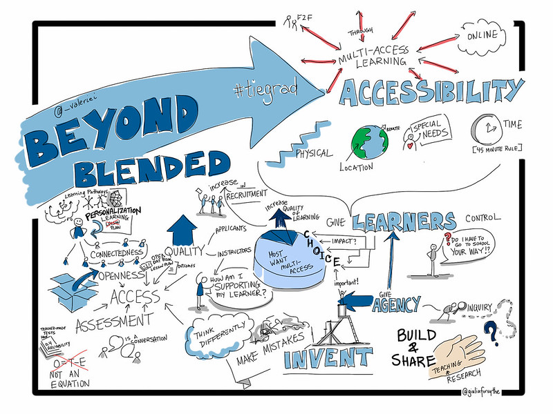

## Unit 5: Educational Experience in a Multi-Access World

[plugin:content-inject](_checklist)

This unit investigates the nature of educational experience, and how to guide it within the emerging learning settings where the teaching presence is now being distributed across multiple modalities and instructional roles. In this emerging model there is a systematic division of labour of the traditional teaching responsibilities. For instance, in one emerging model of multi-access education the teacher designs a course and assesses the students’ learning. However, the work of facilitating and directing the social and cognitive processes for the purpose of realizing the learning outcomes is now the responsibility of learning coaches and facilitators.  

### Topics

This unit is divided into the following topics:

1.	What is Educational Experience?
2.	What Makes a Learning Experience Educational?
3.	Study as the Site of Education
4. The Institutionalization of Teaching and Learning
5. Emerging Models of Open and Multi-Access Education
6. Multi-Access Learning Environments

### Learning Outcomes

When you have completed this unit, you should be able to:
- Describe the characteristics of educational experience.
- Analyse the characteristics that make a learning experience educational.
- Identify the ways institutional learning and teaching is changing.
- Understand the difference between pedagogy and modality.

### Resources

Online resources will be provided in the unit.

[ui-accordion independent=true open=none]
[ui-accordion-item title="Topic 1 - What is Educational Experience"]
 
In Unit 1 we were introduced to the idea that a learning environment can be understood as overlapping presences: *cognitive presence, social presence,* and *teaching presence.* In this unit, we explore what is experienced within this environment by examining the theoretical ground the CoI model is built upon.

The community of inquiry model is based on the broadly promoted idea within the contemporary field of education that people learn through experience—their own and the experience of others. What is experience? In the broadest sense, experience is a personal lived encountering, or undergoing, of some event. In this way, a person might say that they have experienced running—a recreational activity some people enjoy. Accordingly, this person might describe their experience as the physical sensations going on in their body and also their perceptions of what is going on in the world when they are running. Their experience in this case may be considered beyond the mere physical, and also include the emotional, cognitive, volitional, spiritual, or any of number of other characterizations of human nature. This experience denotes a form of knowing. In this sense, the person might say that they have experience in running, or that they are an experienced runner. Conceptions of experience as knowledge span a diverse spectrum of ways of knowing from empiricism to existentialism. Thinking about what it truly means to know through our experience, and how we gain experiential knowledge is fundamental to education.  

The American pragmatist philosopher John Dewey (1916/2004) argues in *Experience and Education* that our concept of experience is essential to education, because “education is a development within, by, and for experience” (Chap. 1). Experiential knowledge is frequently assumed to be procedural rather than propositional. In keeping with this line of thinking, Dewey (1915) states, “no book or map is a substitute for personal experience; they cannot take the place of the actual journey” (p. 255). Dewey’s statement echoes the oft-quoted Chinese proverb by Xun Zi: “Tell me and I will forget. Show me and I may remember. Involve me and I will understand.” However, this is a limited understanding of experience as Dewey (1915) goes on to clarify, “learning by doing does not, of course, mean the substitution of manual occupations or handwork for text-book studying” (p. 255). His point, here, is that the studying of texts is also an “experiential learning” activity. In short, experiential knowledge is both procedural and propositional in nature. What is important to our discussion in this course is simply the fact that, clearly, we learn through experience—our own and the experience of others, through direct observation and conversation, and indirectly through mediated forms, notably written texts. This raises a key question, what is experience that we may say we learn through it? Or simply, what is educative experience?

According to Dewey’s theory of education and experience, one’s learning experience arises from the interaction of two essential principles—continuity and interaction.  Continuity refers to his idea that each experience one has will influence, in some way, one’s future experiences. Building on continuity, interaction expresses the relationship between one’s past experience and present learning situation.

! Continuity of experience, in Dewey’s (1938) words, *“means that every experience both takes up something from those which have gone before and modifies in some way the quality of those which come after”*(p. 35).

Put different, every experience that a learner enacts or undergoes modifies that learner, and this modification (whether the learner likes it or not) affects the nature, quality and direction of the learner’s subsequent experiences. In this way, then, we may come to speak of a person growing, developing, or transforming not merely physically, but intellectually, morally, and so forth. This idea of growth expressed within the principle of continuity also suggests direction, ends, or outcome.

For instance, we say learners “grow” to become experts (in something). Indeed, “expert” and “experience” are both derived from the same Latin verb (meaning “to test, or to prove”). Thus, by expert, we mean one tested and/or proved by experience. For instance, as a facilitator of a university course, your prime directive is to guide learners though learning experiences that ultimately lead to the learning outcomes prescribed in the course syllabus. Put in Dewey’s theoretical terms, we might say one thing you are trying to facilitate within the learning environment you create is the continuity of your students’ learning experiences, such that their experiences result in their transformation in some way that demonstrates the course learning outcomes. This idea is critical to your role as facilitator.

While a learning experience is something internal to a person, shaping attitudes, desires, purposes, understandings, and knowledge, it also has an active side that “changes in some degree the [world of persons and things within] … which experiences are had” (Dewey, 1938, p. 39). That is, as Dewey (1916/2004) writes elsewhere, “when we experience something we act upon it, we do something with it; then we suffer or undergo the consequences” (p. 133). Dewey suggests that one acts within a world and one’s world acts upon them. The principle at play here is the interaction of experience.

> “An experience is always what it is because of a transaction taking place between an individual and what, at the time, constitutes his environment.” -- (Dewey, 1938, p. 43)

Here, environment refers to “whatever [external] conditions interact with personal needs, desires, purposes, and capabilities to create the experience which is had” (Dewey, 1938, p. 44). As a facilitator you guide students’ interaction with their learning environment, according to the course designer’s intentions.

Taken together Dewey describes the interplay of his two principles of experience—continuity and interaction—as a learning situation. These two aspects of the learning experience, then, “intersect and unite,” as a learning process wherein “as an individual passes from one situation to another, his world, his environment, expands or contracts” (Dewey, 1938, p. 44). The value of one’s experience, may be judged according to the positive or negative effect that it has on one’s present and future.

Dewey describes the mechanics of the interplay of continuity and interaction as a trial and error learning process. He states, “We simply do something, and when it fails, we do something else, and keep on trying till we hit upon something which works, and then we adopt that method as a rule of thumb measure in subsequent procedure” (Dewey, 1916/2004, p. 139). Dewey’s experimental view of learning has inspired inquiry-based, constructivist, discovery based, and similar pedagogical models of educational practice. Indeed, the theories of educational interaction introduced in unit one and others you will encounter in this course are rooted in Dewey’s conceptualization of learning experience.

The course designer has crafted a course of study and associated active learning experiences in the facilitator’s guide. The course designer’s intent is to lead the student, with the help of your facilitation, through a continuity of interactions leading to positive growth in the learner, as defined by the learning outcomes. As facilitator your role is to help learners navigate this pathway of learning experiences and ensure the intended continuity of learning experiences and the intended learner interactions between the learners and these experiences is achieved.

In sum, Dewey’s theory suggests three critical practices for facilitating learning:

(a) the need to intentionally link new learning experiences with past ones in a logical and progressive way

(b) the need to identify what the learner already knows

(c) helping the learner make their learning meaningful (not merely as preparation for the future, but in the present)

Every learner and group of learners is unique, each bringing different prior experiences to each new learning situation you will facilitate. So, part of your role is to help learners navigate gaps in continuity and make judgements about what active learning experiences are best suited to helping learners grow.

[plugin:content-inject](../_5-1)

[/ui-accordion-item]

[ui-accordion-item title="- Learning Activity"]
 
#### :fa-book: Read and Reflect

The first Learning Activity for Unit 5 will focus on the work of John Dewey in his writing *Experience and Education.* While the link below will take you to the entire text (*which you are more then welcome to read!*), the focus for this section will be on Chapter 2 titled: ***The Need of a Theory of Experience.***

 - [**Experience and Education: Chapter 2**](http://ruby.fgcu.edu/courses/ndemers/colloquium/experienceducationdewey.pdf)

---

#### ***Questions to Consider...***

After completing the reading above, consider the following questions:

 - ***What is a learning experience?***
 - ***What two principles does Dewey identify that shape our learning experiences?***
 - ***How might you apply Dewey’s model to facilitating a learning experience for others?***

[/ui-accordion-item]

[ui-accordion-item title="Topic 2: What Makes a Learning Experience Educational?"]
 
As course facilitator you must choose from different activities. You will need to decide which ones will best help each student achieve the course learning outcomes. In some cases, this decision will be based on what activities are most appropriate for a certain group of students, or perhaps even for a particular student. And in other cases, the decision will be necessary because there is not enough time to complete all the activities that have been set out by the course instructor/designer. You will also find yourself in situations that are teachable moments where how you facilitate student learning will have a significant impact on the degree and quality of student transformation. The question this discussion raises is how do you decide what is the best experience to facilitate learning in a given situation? To make good judgements requires a careful understanding of what makes an experience worthwhile.

For many, the concept of education is equivalent with schooling. However, as the American author Mark Twain famous quipped, “don’t let school interfere with your education.”  Twain, who was not educated beyond elementary school, was cynical towards the school system, believing that “education” is different from “schooling.” Indeed, he suggested, “Education consists mainly of what we have unlearned.” In other words, education involves the growth and transformation of a whole person. While a school may be a place we learn to read, write, and do arithmetic; to be educated, and hence, to have received an education suggests one becomes something.

In *Ethics and Education,* educational philosopher R. S. Peters (1966) argues that the term “education” has “normative implications.” That is, it suggests a worthwhile outcome is to be achieved:

!!! It implies that something worth while is being or has been intentionally transmitted in a morally acceptable manner. It would be a logical contradiction to say that a man (sic) has been educated but that he had in no way changed for the better, or that in educating this son (sic) a man (sic) was attempting nothing that was worth while. This is a purely conceptual point. Such a connection between ‘education’ and what is valuable does not imply any particular commitment to content. It is a further question what the particular standards are in virtue of which activities are thought to be of value and what grounds there might be for claiming that these are the correct ones. All that is implied is a commitment to what is thought valuable. (p. 25)

Peters’ (1966) assertion that the term education is more than merely a synonym for learning is surely correct, albeit uninformative. For learning is something that human beings simpley do regardless of whether it is of moral value or not. People naturally learn all sorts of things, including negative attitudes, defensive social skills, and various forms of misinformation, which are counterproductive to one’s identity, purpose, values and goals, or role in society. Thus, while an accurate definition, Barrow and Woods (2006) argue that Peters’ definition leaves two interesting and vitally important questions unanswered, “What are the worthwhile things which are to be transmitted?” and “How do we tell whether a manner of transmission is morally accepted or not?” (p. 30).

The “what” and “how” questions of education take us a step closer to understanding what it means to be educated. Broadly speaking, Peters’ assertion that education involves something of value being learned in a particular way implies that to become educated involves a transformation or a change. That is, to become educated means one becomes something. Consider, our common use of “to educate” in our everyday speech. When we say we must educate someone about something, such as, “We must educate the public” about such-and-such, “the clear implication of this familiar way of speaking is that certain information is to be imparted, this information is to be understood and, in virtue of the understanding, what people do, or do not do, is to change” (Barrow and Woods, 2006, p. 35). Thus, clearly education means not only coming to *know* such-and-such, but *how* to do various sort of things.

---

[plugin:content-inject](_premodern)
---

[plugin:content-inject](_modern)
---

[plugin:content-inject](_postmodern)
---

[plugin:content-inject](../_5-2)

[/ui-accordion-item]
[ui-accordion-item title="- Learning Activity"]
 

#### :fa-question: Questions to consider...

After completing the reading above, consider the following questions:

 - ***What makes a learning experience educational?***
 - ***What conception of knowledge (pre-modern, modern, or post-modern) characterizes Dewey’s conception of experiential knowledge outlined in Experience and Education, Ch. 2?***
 - ***Why is it important for educators to understand how they conceptualize knowledge?***
[/ui-accordion-item]
[ui-accordion-item title="Topic 3: Study as the Site of Education"]
 

Learning ultimately occurs within the cognitive presence of individual learners, through their personal interactions with their self and the content. Historically, this educational experience has been widely understood as the practice known as study. McClintock (1971/2000) argues, “whether we like it or not, many … educators considered education to consist of neither teaching nor learning; instead, they found the diverse forms of study to be the driving force in education” (p. 167). While instruction in all of its various forms may play a role, the learner is always the one who does the work of learning. Citing Montaigne’s (1877) essay “Of the Education of Children” McClintock (1971/2000) notes, “teaching and learning might impart knowledge, whereas study led to understanding, whereby things known were made one's own and became a part of one's judgment, and ‘education, labor, and study aim only at forming that’” (p. 162). Here, we see how Dewey’s notion of the importance of learners adding their own meaning and application to what they learn connects to a thread of thought with a long history. We also see the educational idea of the normative or ethical element of whole personal transformation.

***What is study?*** The term comes into English as a shortening of the Old French noun *estudie,* and its verb form *estudier,* both based on the Latin term *studium.* This is also the root of the Latin word student. Cicero provides us with a formative use of the term in De Inventione:

!!! *Studium est autem animi assidua et vehementer ad aliquam rem adplicata magna cum voluptate occupatio, ut philosophiae, poeticae, geometricae, litterarum” [“Study is the assiduous and vehement occupation of the mind applied to anything with great eagerness (voluntate), as the study of philosophy, geometry, letters.”* (as translated in O'Malley, 1881, p. 269)] (1.36).

Cicero’s notion of study turns on the idea that it is an “occupation” of the mind, specifically, mental work that has to be done, or matters of the mind that have to be attended to. Moreover, study, here, is a careful application of this mental attention to a subject of inquiry. Indeed, study is an act of considerable labour as Erasmus (1965) writes in his dialogue The Art of Learning, “For my part, I know no other art of learning than hard work, devotion, and perseverance” (p. 461). As educators tasked with coaching others for learning and facilitating learning experiences it is important to be clear that ultimately it is the student who must do the actual work of learning. Indeed, regardless of how much help we as educators can provide students with their learning, learning is often difficult work. Therefore, a significant role that you play is to help by encouraging students to do this challenging task.

Cicero’s definition also suggests study is a zealous act of pleasure. He argues study is not merely the laboured devotion of time and attention to acquiring knowledge on a given subject, but rather a passionate pursuit of knowledge. Commenting on Cicero’s definition, O’Malley (1881) writes,

!!! *Whatever we strongly love we desire to possess, and if we see any probability of our efforts being crowned with success, we strain every nerve to make it our own. So intense is the pleasure of the votaries of knowledge as she unfolds and offers them her treasures, that labour ceases to be labour, or, if you will, becomes a labour of love, and receives a name which indicates its agreeable nature.* (p. 269)

Pleasure, here, is not limited only to a life of leisurely study, as was historically most commonly enjoyed by those who were, or were amongst, the elites, but rather is at its heart an act of utility to win self-control through self-formation. That is, study is historically the domain of what we now refer to as transformational learning. This transformational act of study may take many forms. As McClintock (1971/2000) puts it, “the ways of study are as diverse as the ways of men (sic), for both result, not from conformity to outward precept, but from the aspiration to assert inward control over the moving conjunction between one’s self and one’s circumstances” (para. 13). While the highest goal of study—such as, Plato’s pursuit of the “Good,” or Aristotle’s human “flourishing”—may be the same, or similar, “the path, the course of study, that leads to the goal will differ for each: thus the study appropriate for the quite cleric will not suit the proud prince, the worldly merchant, or the study artisan” (para. 14). Study emerges from the particular and unique lifeworld or lived-experience of those individuals who study—that is, the subjective human interests of students. As educators coaching for transformational learning, part of our role is to help students identify and clarify what interests them. What is more, we can help students connect their interests with their course of study and help them find joy in learning.

***How does one study?*** For McClintock (1971/2000), “study itself is neither a single path nor the final goal; it is the motivating power by which men (sic) form and impose their character upon their role in life” (para. 14). That is, study is an act of transformation and growth. Pinar (2006) helpfully adds that McClintock’s the use of “the verb ‘impose’ is too voluntarist and essentialist” because transformational learning or “reinvention of ourselves is limited, and occurs, yes, through acts of ‘will,’ but, as well, through waiting, withdrawing, dissimulation” (p. 112).  Historically, transformational learning was seen as the outcome of study—that is, learning was the result of study. Similarly, the historic idea of teaching was simply helping a student to study. Underlying this historic view of study as education was the recognition of human individuality, autonomy, and creativity. On this point, McClintock (1971) writes:

!!! *To those who thus recognized each person's autonomy of judgment, education could only incidentally be a process of teaching and learning; more essentially, it had to be a zig-zag process of trial and error, of studious, self-directed effort by which an inchoate, infantile power of judgment slowly gave itself form, character, perhaps even a transcendent purpose. This effort was study in its most general sense.* (p. 168)

Building upon the idea of study as self-formation is the student’s subjective habit of making sense of the world and finding their own way in it. It is a movement of thought characterized by Pinar’s (1975b, 2004) conception of *currere,* a running within the learner’s own lived-experiences. Understood as *currere,* study is a subjective act of structuring an objective world, upon which the learner imposes their own idiosyncratic subjectivity, which this world, then, embodies as their world of thought (Grumet, 1975). It is an attentive and open dialogue with the world of the learners lived-experience made possible by human language, which makes study discursive. As the dialogue with the learner’s lived-experience study is a reflective act where the learner both reflects in and on their experience (Schön, 1983). Through study, the learner prepares for future action by using their experience of the past. They reflect on present action, building upon what they already know. And, they consider what they don’t know, or what they think they know but don’t really, to estimate emerging opportunities, and predict future action by imagining the impossible and determining new capabilities. Study, writes Pinar (2015), “provides that knowledge from which we exercise judgment, as we reflect not only on the possible consequences of that step we’re about to take next, but the effects of steps that we have taken before” (p. 192). As an educator who is coaching students in their own study, your role is to help them develop their own judgement as they reflect in and on the learning experiences set out in their course of study. More importantly, you are helping navigate a dialogue with themselves about who they are becoming.

As educators coaching students for transformational learning our overarching aim is to help students make sense of how to reflect in and on the converging and emerging of their past, present, and future. How does this work? Pinar (2015) characterizes this self-transformational that is study as follows:

!!! *The unforeseeable future, the not fully accessible present, as well as the persistence of the past, converge to contribute to the gravity of study, even when it is conducted playfully. Study acknowledges the mystery saturating everyday life, thereby decentering the self as it redirects our attention to reality in which we live. Steadied through study we can reactivate the past in the present, unsettling our sense of what is at stake in the situation we face today and tomorrow. Studying the past permits us to anticipate the future. Not only temporality structures study, so does space, as the boundaries of one’s world blur into the world, which we know extends well beyond our capacity to apprehend it.* (p. 192)

Bound by a space and a time, study is a particularity, not a generality. Study is embodied in individual lives, it is a place and situation “saturated by meaning, with culture and history as these are personified in specific people with whom we live as neighbors, fellow citizens, and humanity” (Pinar, 2015, p. 192). The act of study as defined by McClintock and Pinar is not something, which is limited to a formal program of study. Rather, McClintock and Pinar remind us all of culture, and nature, can be educational. Going back to antiquity, Hutchins (1968, p. 133) notes that “education was not a segregated activity,” but rather as was the situation in Greece, “the Athenian was educated by culture, by paideia” (p. 33). The critical insight to emerge, here, is that “study is the site of education” (Pinar, 2006, p. 112). The nature of study is a very personal, often difficult, potentially joyous, dialogue of self-transformation. As educators, our ultimate role is to help others in their personal acts of study and self-transformation.

[/ui-accordion-item]
[ui-accordion-item title="- Learning Activity"]
 
#### :fa-question: Questions to Consider...

After completing the reading above, consider the following questions:

- ***How would you describe your own experiences of transformational learning?***
- ***What is transformational learning and how does it relate to the act of study?***

[/ui-accordion-item]

[ui-accordion-item title="Topic 4: Institutionalization of Teaching and Learning"]
 
In his essay *“Towards a place for study in a world of instruction”* McClintock (1971/2000) observes how the modern era’s institutionalization of study progressively led to a fundamental shift in practice:

!!! *Rarely does one hear that study is the raison d'etre of an educational institution; teaching and learning is now what it is all about, and with this change, has come a change in the meaning of the venerable word "learning." Once it described what a man acquired as a result of serious study, but now it signifies what one receives as a result of good teaching. The psychology of learning is an important topic in educational research, not because it will help students improve their habits of study, but because it enables instructors to devise better strategies of teaching.* (p. 179).

The institutionalization of study begins as the story of how education begins through family relations. Grumet (1988) argues, *“what is most fundamental to our lives as men and women sharing a moment on this planet is the process of reproducing ourselves” (p. 8)*. The critical insight, here, is that as human beings we reproduce ourselves biologically, ideologically and critically. While familial learning practices have histories beyond memory or record, we may infer from accounts of foraging societies that “the youth [were] trained to practice the arts which their parents [knew], to continue their friendships and alliances, and to cherish their resentments” (Williams, p. 19). Studies of juveniles in hunting and gathering societies, as well as in lower primates social groups, suggest there was “little teaching (that is, direct and deliberate tuition) of the younger members by mature individuals” (Herzog, 1984, p. 74).

Rather, learning in the distant past was a socialization process, predominately in the form of “play” with “peers and slightly older playmates” involving “imitative activities” of “competent behavior” being observed within the context of the local “social and physical environment” during a “period of freedom from responsibility and of the need for self-support” that was “unusually long” compared to other species (Herzog, 1984, pp. 75-74). This process of learning through indirect (social role-modelling) and direct teaching in family relations continues today in the pre-school years of children.

Western institutions of study first appear within the context of ancient Greek society. The Greek system was based on both informal familial and community schooling, along with formal schooling in the form of private tutors or schools for those of economic means. The existence of formal schooling in early antiquity, however, does not mean it was commonplace. Indeed, the primary institutional form of education was the family and community. In ancient Athens, as noted in the previously:

!!! *[E]ducation was not a segregated activity, conducted for certain hours, in certain places, at a certain time of life. It was the aim of the society. The city educated the man.* (Hutchins, 1968, p. 133)

The ancient person was educated first by family and then, by culture (that is, *paideia*). One’s familial and cultural relations largely defined the ancient life-world of study. However, as these ancient societies—notably, Greek city-states—rationalized, becoming states and nations defined by laws and rules, institutional systems of study emerged to support the reproduction of increasingly complex forms of social order.

Plato (2003) cast a formative vision of this institutionalized world of study:

!!! *By maintaining a sound system of education and upbringing you produce citizens of good character; and citizens of sound character, with the advantage of a good education, produce in turn children better than themselves and better able to produce still better children in turn, as can be seen with animals.* (p. 125)

While Plato’s idea had little affect in his own time, clearly, the shadow that his idea has cast upon the future is significant. Indeed, we might argue that Plato planted an ancient seed that became our modern idea of progress cast, here, within the context of formalized education. Closely related to his idea of progress, and progress in a society’s institutionalization of study is Plato’s notion of the “good.” The good is a central element of Plato’s theory of knowledge, his vision of a just society and individual, and the purpose of his system of education (that is, his institutional view of study). Plato’s pithy definition of the good comes near the end of the *Republic* when he compares the concept with that of evil by stating, “I call anything that harms or destroys a thing evil, and anything that preserves and benefits it good” (Plato, 2003, p. 355). His definition appears to be straightforward and clear, but it raises questions about what precisely does he have in mind by “anything that preserves and benefits” a thing? In social terms, his “Good” relates to the preservation and benefit of the whole community. For the individual, it relates to the preservation and benefit of a person’s mind/soul as a whole.

For Plato, development of the good is made possible through study. Specifically, it is the individual’s upward progress of the mind from the lower world of shadows and opinions towards the upper world of light and knowledge. Beyond what we can know lies the “Good,” which is distinct from knowledge, and yet it is through knowledge that one can come closest to the “Good.” While Plato’s epistemology is clearly more complicated, the important insight for our current discussion is that Plato established the subsequently persistent idea that study is directional, and that it is oriented toward seeking *ends.* That is, study is an educative experience that results in a person becoming *educated.* The way we began to formalize how someone could become educated was through the idea of a “course” of study.

### The Course of Study

Within educational institutions a *course* of study, or simply a course, is generally referred to the curriculum. Interestingly, these two education terms, course and curriculum, are closely related. As Egan (1978) explains, the initial Latin meaning of the word curriculum “was ‘a running,’ ‘a race,’ ‘a course,’ with secondary meanings of a ‘race-course,’ ‘a career.’” (p. 66). What is curriculum? Put simply, it is “what is to be taught and how” (Alexander, 2001, p. 549). Framed broadly, “curriculum communicates what we choose to remember about our past, what we believe about the present, what we hope for the future” (Pinar, 2004, p. 20). Dewey provides us with a helpful analogy about the curriculum as both a map and a journey. That is, his map image describes *curriculum as a plan* and his journey image described *curriculum as a lived experience.* Dewey’s main point is to caution us against mistaking the map for the journey; however, he also recognized the crucial role the map plays in this journey.

Explaining the important role of the map Dewey (1902) writes:

!!! *Well, we may first tell what the map is not. The map is not a substitute for a personal experience. The map does not take the place of an actual journey. The logically formulated material of a science or branch of learning, of a study, is no substitute for the having of individual experiences. The mathematical formula for a falling body does not take the place of personal contact and immediate individual experience with the falling thing. But the map, a summary, an arranged and orderly view of previous experiences, serves as a guide to future experience; it gives direction; it facilitates control; it economizes effort, preventing useless wandering, and pointing out the paths which lead most quickly and most certainly to a desired result. Through the map every new traveler may get for his own journey the benefits of the results of others’ explorations without the waste of energy and loss of time involved in their wanderings–wanderings which he himself would be obliged to repeat were it not for just the assistance of the objective and generalized record of their performances. That which we call a science or study puts the net product of past experience in the form which makes it most available for the future. It represents a capitalization which may at once be turned to interest. It economizes the workings of the mind in every way. Memory is less taxed because the facts are grouped together about some common principle, instead of being connected solely with the varying incidents of their original discovery. Observation is assisted; we know what to look for and where to look. It is the difference between looking for a needle in a haystack, and searching for a given paper in a well-arranged cabinet. Reasoning is directed, because there is a certain general path or line laid out along which ideas naturally march, instead of moving from one chance association to another.* (p. 284)

The learning design and its associated documents that we create as educators constitute a map of the terrain to be covered within a course of study (that is, a learning program). Nevertheless, it is important to recognize it is not an exhaustive view of the territory, but simply sets directive guidance for the teachers’ and students’ journey through this terrain. In short, *curricular documents, like a syllabus, simply serves as the guide to the learning experience.* As educators, we shouldn’t be bound to it. In our role of coaching and facilitating transformational learning our role is to acts as guides in the curricular journey that students are undertaking and they work to complete a particular course of study.

[/ui-accordion-item]
[ui-accordion-item title="Topic 5: Emerging Models of Open and Multi-Access Education"]
Online learning, blended learning, flipped classroom, face-to-face, hybrid course, multi-access... you may have heard some of these terms tossed around, especially recently with the shifting focus to online. Before we unpack and examine these modalities of learning, consider how learning in Higher Education has changed. *What are the shifts that have happened in the last 20, 10, 5 years? How has technology shaped the way teachers teach and the way students learn?*
[/ui-accordion-item]
[ui-accordion-item title="- Learning Activity"]
 
#### :fa-book: Read and Reflect

After taking a moment to consider the questions above, read Chapter 1 of our core text, *Teaching in a Digital Age* by Tony Bates. It can be found by clicking on the following link:

***Note:*** *Particularly focus on sections 1.6-1.8.*

 - [embedly url="https://pressbooks.bccampus.ca/teachinginadigitalagev2/part/chapter-1-fundamental-change-in-education/"]

---

#### ***Questions to Consider...***

After completing the reading above, consider the following questions:

 - ***What changes have you seen in Online Learning?***
 - ***What changes to you foresee in the next few years?***

[/ui-accordion-item]

[ui-accordion-item title="Topic 6 - Multi-Access Learning Environments"]
 
One trend that is gaining traction is **Multi-Access Learning.**

Read the following excerpt from *Realigning Higher Education for the 21st-Century Learner through Multi-Access Learning* by Irvine, Code & Richards (2013):

[plugin:content-inject](_multi-access)

*Source: Tiers of the multi-access framework (Irvine, Code & Richards, 2013).*

With the uncertainty brought on by COVID-19, multi-access learning has great potential for our education system. This modality not only brings more choice to students, but promotes a learner-centred course design and best practices in teaching and learning.

#### Read more about the 4 tiers of multi-access learning:

  
<b>Tier 1 - Click here to expand</b>

    
The first tier of multi-access learning is what most of you have experienced (as learners and faculty) as the predominant modality of higher education, face-to-face (f2f). F2f learning environments are often assumed to be the preferred modality of learning because a f2f classroom allows for rich, multi-modal interactions and robust community-building. This is true to an extent, but only if class sizes are very small; large, lecture-based classrooms present significant challenges to building the kind of critical and safe community for engaged interaction.

---

  
<b>Tier 2 - Click here to expand</b>

    
The second tier of access allows learners who cannot travel to a central campus (like during a worldwide pandemic) to participate in a learning community syncronously via video conferencing. Remote and local learners may exchange items and artifacts and may share video feeds and use software such as Etherpad or screensharing through the web-conferencing tool to collaborate on documents for co-creation of content.

---

  
<b>Tier 3 - Click here to expand</b>

    
The third tier provides asynchronous access for remote learners who cannot join the scheduled class session due to any number of constraints (employment, child/elder care, time-zone, or even network bandwidth). Irvine, et al. acknowledge that simply viewing a recording of a synchronous session, regardless of how collaborative and engaging that session may have been, is a much leaner experience for learners and may not be optimal. This highlights the need to provide learning materials in formats beyond video and audio, perhaps including text-based materials and asynchronous tools for co-creation of content such as GitHub.

---

  
<b>Tier 4 - Click here to expand</b>

    
The outermost tier of the model is for open participation from non-credit learners who are choosing to participate for their own interest and edification. It may seem anathema to some faculty to consider opening their course to the world, but the benefits can be significant, particularly in times like the spring of 2020.

[/ui-accordion-item]
[ui-accordion-item title="- Learning Activities"]
 
#### :fa-camera: Look, Read, and Reflect

This Learning Activity begins by asking you to take a close look and consider the following picture:

***Next, read***
[embedly url="https://jolt.merlot.org/vol9no2/irvine_0613.htm"]

#### ***Questions to Consider...***

After taking some time to consider the picture, along with completing the reading above, consider the following questions:

 - ***What ideas surround multi-access learning, according to the image?***
 - ***What is your definition of multi-access learning?***
 - ***If you were asked to provide multi-access learning for your course, what initial questions would you have?***

#### :fa-book: Read and Reflect

***Read***
[embedly url="https://pressbooks.bccampus.ca/teachinginadigitalagev2/part/chapter-10-modes-of-delivery/"]

#### :fa-pencil: Key Terms Quiz

Take the following quiz to test your understanding of the key modalities:

!!! *Please note, this is an ungraded quiz.*

[h5p id="77"]

So how does this Multi-Access model of learning compare to what you have experienced as an instructor? You may teach online, on campus, or have a blended approach in your courses. What are the key differences between these approaches and modalities?

[/ui-accordion-item]
[ui-accordion-item title="Supplementary Resources"]
 
## Resources for Online Models of Learning

If you are interested in learning more about online models of learning, feel free browse through the following resources:

[plugin:youtube](https://www.youtube.com/watch?v=paQCE58334M)

- [**The Flipped Classroom: An Opportunity to Engage Millennials...**](https://pdfs.semanticscholar.org/daa3/b94cdc7b52b3381a7c7e21022a7a8c005f84.pdf)
- [**Flipping the Classroom**](https://cft.vanderbilt.edu/guides-sub-pages/flipping-the-classroom/)
- [**Blended Learning and Flipped Classrooms**](https://www.unb.ca/fredericton/cetl/tls/resources/teaching_tips/tt_instructional_methods/blended_flipped_classrooms.html)
- [**Blended Learning Activities**](https://www.linfield.edu/tls/blendedlearning/blended-learning-activities.html) from Linfield College. Compares face-to-face approach to online activities, including emailing assignments and feedback, student video presentations, online quizzes and discussions.
- [**Blended and Online Learning**](https://cft.vanderbilt.edu/guides-sub-pages/blended-and-online-learning/) from Vanderbilt University. Tips include: know your learner, present a clear path through the material, promote metacognitive awareness, maintain a social presence, promote collaboration, promote active learning, and incorporate media.

[/ui-accordion-item]
[/ui-accordion]

#### Unit 5 Assessment

Please see the details for Post 5

[plugin:content-inject](../assignments/_blog)

In addition, please submit your Peer Coaching Session, as below.

[plugin:content-inject](../assignments/_peer-coaching)
