!!! It's important that you follow these instructions carefully and completely. Skipping some steps might cause unexpected results.

### GitHub

#### Register for a free GitHub account.
!! You will be sent an invitation to the 'Trinity Western Online' organization in GitHub.

-  Click the link in the email invitation that you received to go to [GitHub.com](https://github.com) and fill in the 'Sign-up' details.
  - You can find more information on the [GitHub Help Pages](https://help.github.com/articles/signing-up-for-a-new-github-account/)
  - Make sure you choose a free plan.
- To complete the sign-up process, you will need to [verify your email address](https://help.github.com/articles/verifying-your-email-address/).

### Install Git

Git is software that you need to be running on your computer in order to do some of the other things that you will learn how to do in this unit. You will only need to install git on each computer once, and then you never have to worry about it again. You will never 'see' git as an app on your computer. It runs in the background.

##### Go to [git-scm.com](https://git-scm.com/downloads)

- click the 'Download x.x.x for Windows/macOS/Linux'
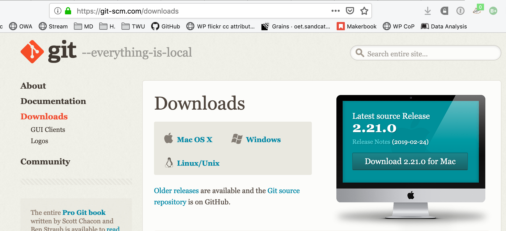
- follow the instructions peculiar to your computer system. You can use the default settings suggested by the installer.

### Install GitHub Desktop

GitHub Desktop is software that  is used for cloning a GitHub repository (repo) to your local computer so that you can edit it using a text editor like Typora or Atom. It is also how you `push` your changes from your local computer to the `remote` repository in GitHub.

! Jargon Alert! A GitHub repository is just a set of text files, usually organized into folders, just like you would keep all the Word files you use for a course inside a folder for that course.

##### Go to [desktop.github.com](https://desktop.github.com) and click 'Download for Windows/macOS/Linux'
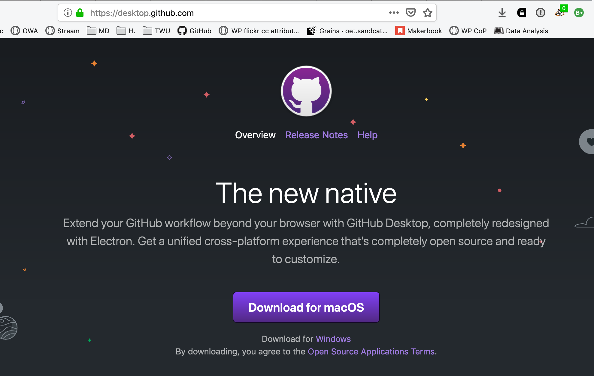

#### Double click 'GithubDesktopSetup'

#### Click 'Sign in to GitHub.com'

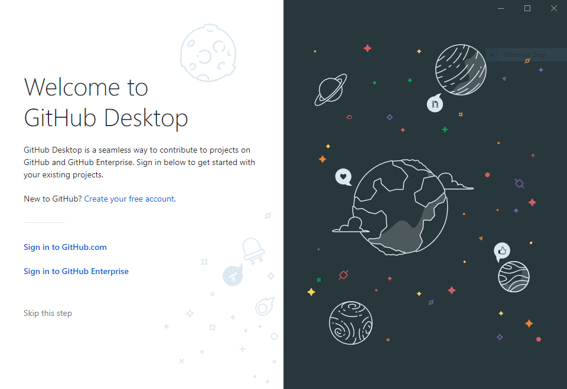

#### Sign in

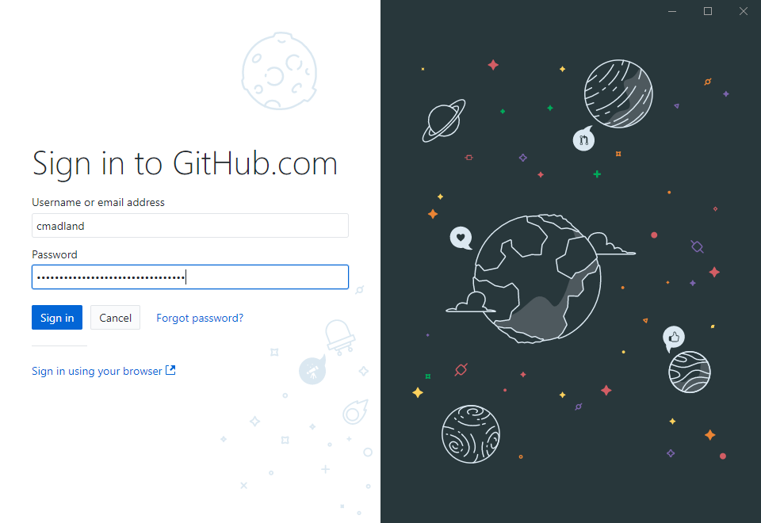

#### Click 'Continue'

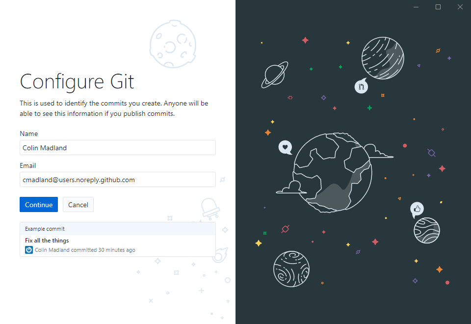

#### Click 'Clone a repository from the internet.'

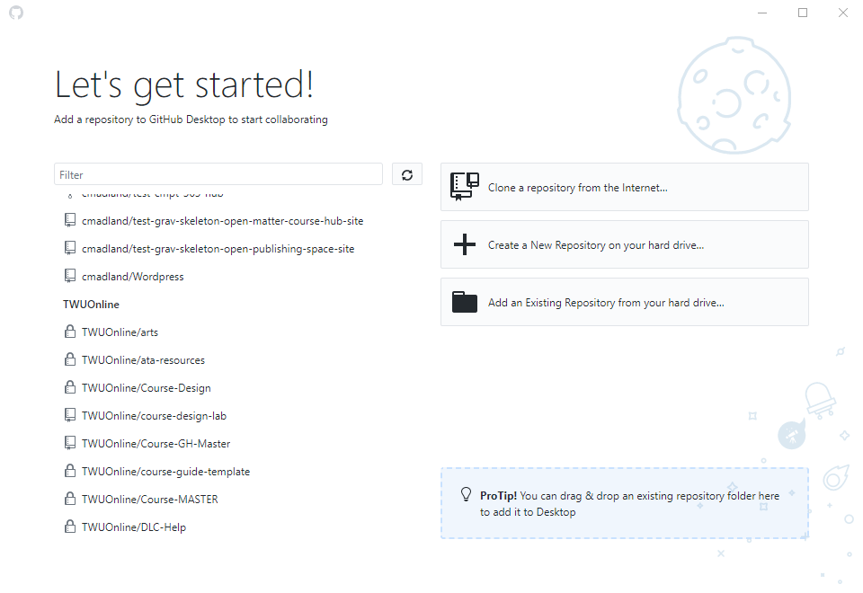

#### Search for 'community' and choose the `TWUOnline/far-community` repo.

This is a private repo, so if you don't see it, send an email to [elearning@twu.ca](mailto:elearning@twu.ca) and ask to be added as a contributor to the repo.

#### Click 'Clone'

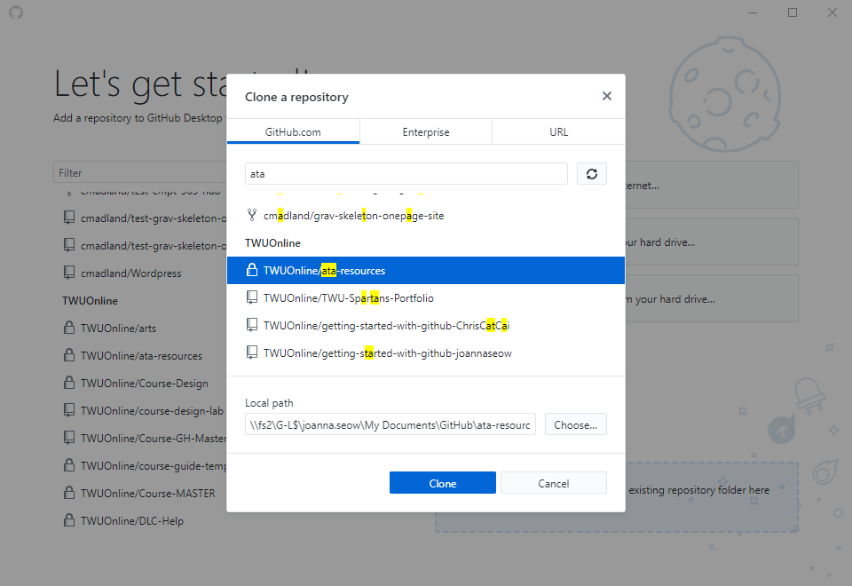

#### Let it do its thing...may take a while.
During this process, GitHub Desktop is cloning all of the files from the `TWUOnline/far-community` repo and making an exact copy on your desktop.

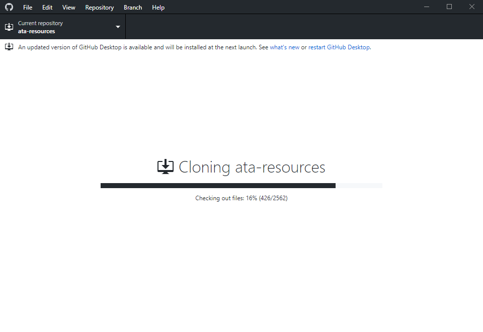

#### Click 'Fetch origin'

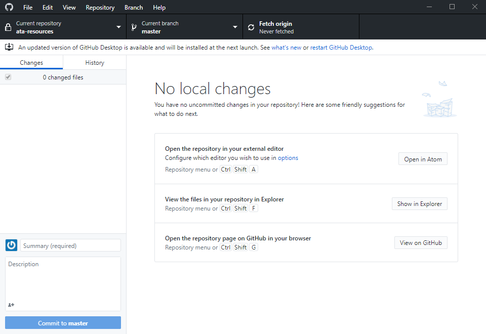

#### If you want to add another repo, go to 'File > Clone repository'

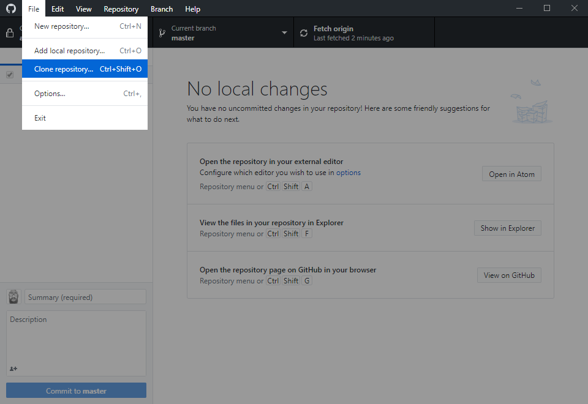

### Typora

Typora is a plain text editor that allows users to edit the files in a GitHub repository. You can go to [typora.io](https://typora.io) to download and install the beta version for free. Typora does not connect directly to GitHub, so once you have made your changes, you need to use GitHub Desktop to commit and push your changes.

## Atom

Atom is also a plain text editor, similar to Typora, `TextEdit`, or `NotePad`, but it is connected to your cloned GitHub repo, so all of the changes that you save locally on your computer can be merged with the GitHub repo from directly within Atom.

#### Go to [atom.io](https://atom.io)

Download and install the appropriate package for your system.

#### Once it is installed, click 'Open a Project'

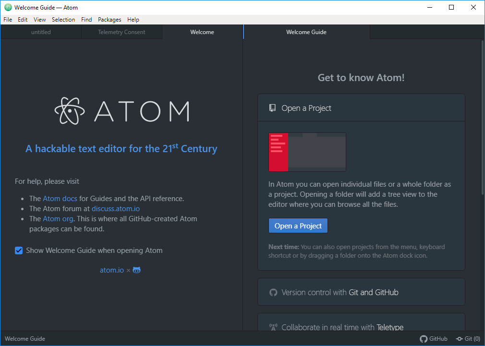

#### Go to 'Documents > GitHub > far-community'

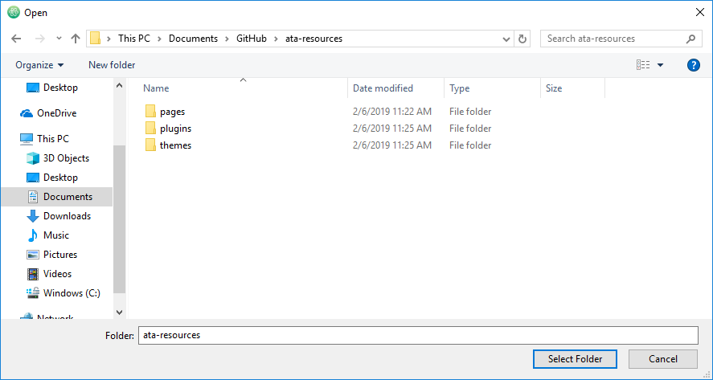

#### The files will appear in the left side 'Project' column

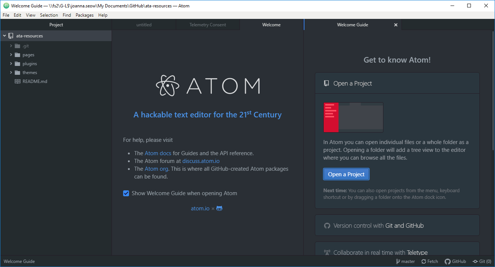

#### To create a new page in Grav, right-click a previous page and click 'Duplicate'.

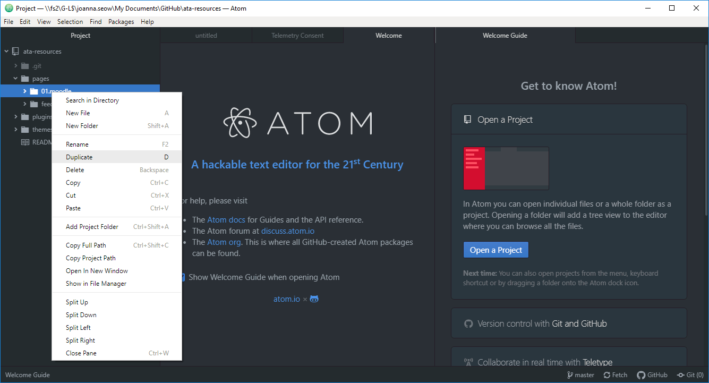

!! You will need to rename the folder as well as the 'docs.md' file within the folder.

### Task Checklist

Ok, here is what you should have completed so far:

:fa-check: Sign up for a free GitHub account.  
:fa-check: Download and install Git.  
:fa-check: Download and install GitHub Desktop.  
:fa-check: Use GitHub Desktop to clone the `far-community` repo.  
:fa-check: Download and install Typora (recommended) or Atom.  
:fa-check: Open the `far-community` repo in Atom.  
