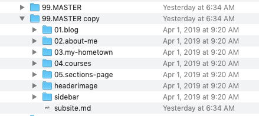
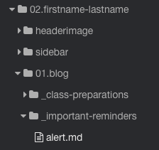

!!!! The following instructions are specificlly for those in LDRS663 who are planning to become FAR Centre Facilitators. If this is not you, you are welcome to dive in and learn this workflow, but it may be less applicable than WordPress.

Now that you have installed the software that you will need and you have cloned the `far-community` repo to your computer you need to open it in Typora.

### Click 'File' and choose 'Open'.

Alternately, you can click 'Open Folder...' in the bottom left corner of the window.

### Select the appropriate repo and click 'Open'.

Tap the title to open the folder, then tap `pages` to see a list of all of your colleagues' sites, as below. As of the first writing, you will only see Colin's site as `03.colin-madland` and the master site as `99.MASTER`. Subsequent cohorts will see all previous cohort sites. You may choose to use a pseudonym here.

### Duplicate '99.MASTER'

Using Typora, you need to complete a few tasks in your Finder (macOS) or Windows Explorer (Windows). Use whichever file navigation system is appropriate for your context to navigate to  the 'far-community' repo, open it, click 'pages' then right click on '99.master' and choose 'Duplicate' from the contextual menu.

You will end up with a copy of the folder...

##### Edit the folder title.

You can complete this step in your Finder/Explorer window or in Typora.

Change the number `99` to the number that corresponds with where your last name is in alphabetical order in the list of sites.  You can duplicate a previous number, so if your name falls between `04.colin-madland` and `05.chisako-takano`, you can use `04.your-name` or `05.your-name`. You will learn how to re-number sites in a later step. Then, after the `.` add your `firstname-lastname` all in lower-case, hyphenated, and with no spaces and hit 'Return/Enter'.

##### Edit `subsite.md`

Complete these steps in Typora.

Inside your new folder, you will find another list of folders and files, as below:

Click on the `subsite.md` file to view its contents, which should look like this:

The content you see above the dotted line is called the `Frontmatter` and it tells Grav how to display the file. This particular file is critical to your site because it controls a bunch of settings for your entire site. Here are the changes you need to make:

1. Change `title: Master` to `title: Your Site Title`. You can choose any title you'd like, but don't use any punctuation.
2. If you would like your site to be unlisted on the community hub, change `hide_from_subsite_list: false` to `hide_from_subsite_list: true`.
3. If you want a different homepage for your site, change `subsite_home: blog` to the name of one of your other folders (without the preceding number and '.') `subsite_home: about-me`, for example.
4. If you want to unpublish your site, change `published: true` to, you guessed it, `published: false`
5.  Feel free to play around with the `true/false` settings.
6. Although you are welcome to keep `subsite_list_description: 'Master of the Interwebs'`, you can also change that to something more suited to your taste.

##### Update the content-inject

Click on the `plugin:content-inject` and you will see it expand into the following:

Change the path from `(/master/blog/_important-reminders)` to `/firstname.lastname/blog/_important-reminders)`.

The content-inject plugin is 'injecting' the content from the file `/firstname.lastname/blog/_important-reminders`

You can edit the `alert.md` file to change the injected content.
