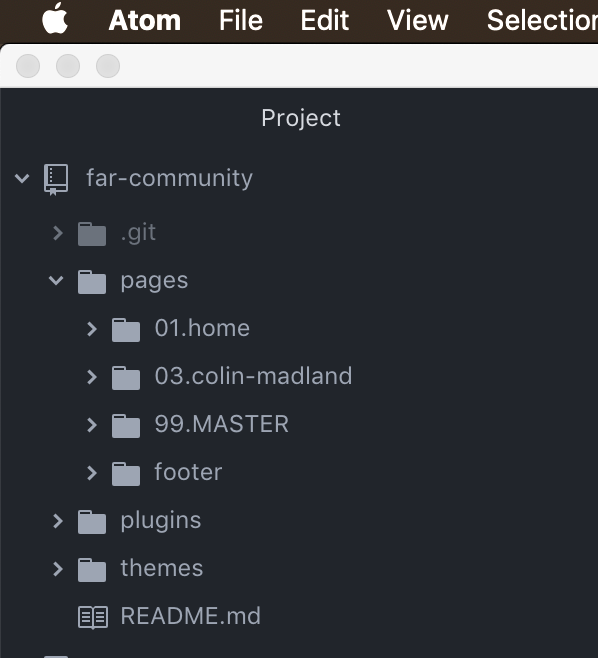
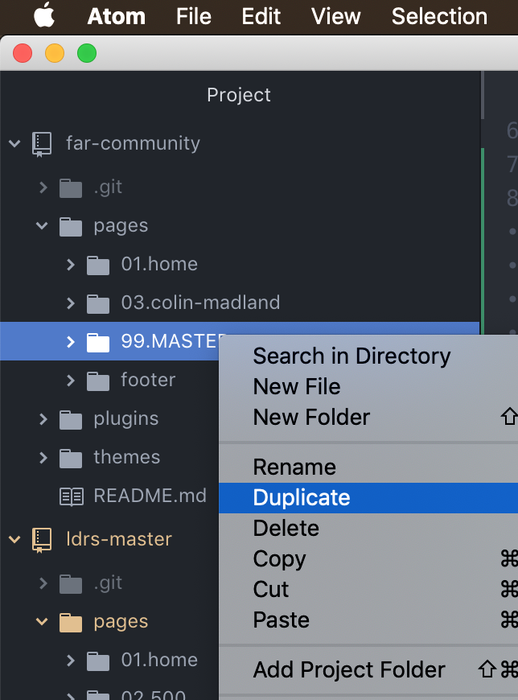
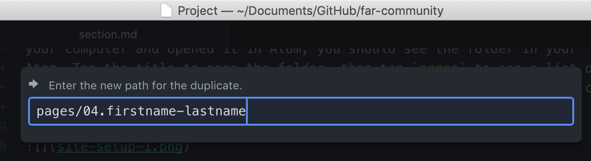
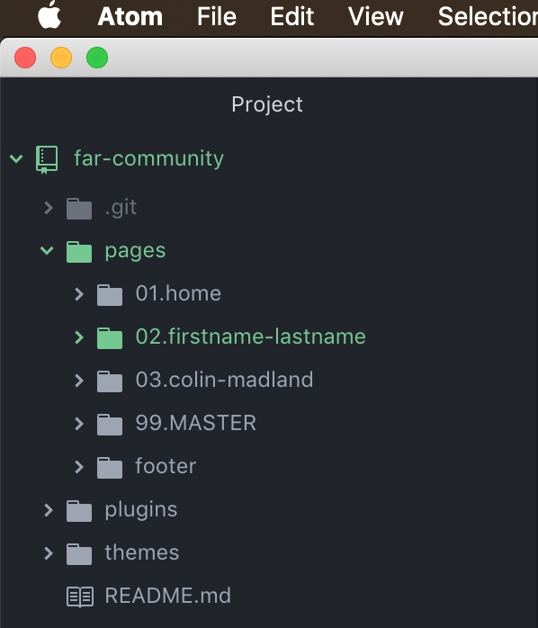
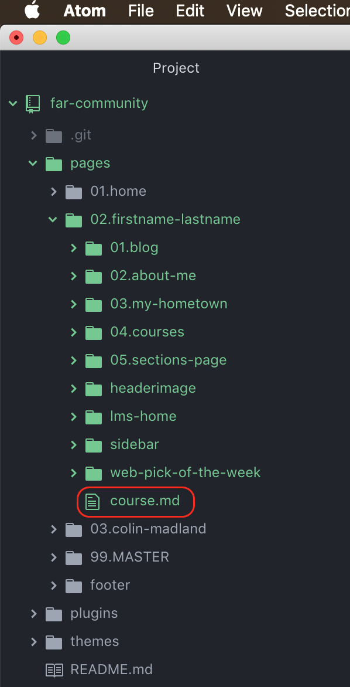
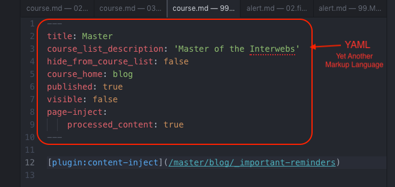
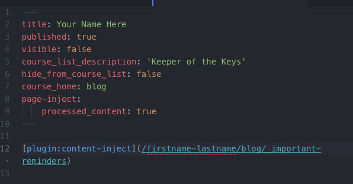
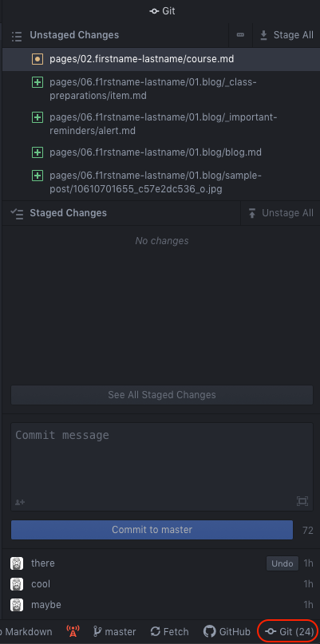

!!!! The following instructions are specificlly for those in LDRS663 who are planning to become FAR Centre Facilitators. If this is not you, you are welcome to dive in and learn this workflow, but it may be less applicable than WordPress.

#### Once Atom is installed, click 'Open a Project'

#### Go to 'Documents > GitHub > far-community'

...or whatever the path is to your repository.

#### The files will appear in the left side 'Project' column

#### To create a new page in Grav, right-click a previous page and click 'Duplicate'.

!! You will need to rename the folder as well as the 'docs.md' file within the folder.

Now that you have installed the software that you will need and you have cloned the `far-community` repo to your computer and opened it in Atom, you should see the folder in your `Project` list on the left panel of Atom. Tap the title to open the folder, then tap `pages` to see a list of all of your colleagues' sites, as below. As of this first writing, you will only see Colin's site as `03.colin-madland` and the master site as `99.MASTER`.

Each numbered folder in the `pages` folder represents a single site in the community. You will be able to customize your site with your own header image and pages as you see fit.

The structure of the Community Hub is identical to the structure of each course hub. The significant difference is that we have several course hubs with each academic discipline area having its own hub, such as `ldrs-master` and `arts-master`.

##### Duplicate `99.MASTER`

To get started on your own site, right-click on `99.MASTER` and choose 'Duplicate' from the dropdown menu.

##### Edit the title.

Change the number `99` to the number that corresponds with where your last name is in alphabetical order in the list of sites.  You can duplicate a previous number, so if your name falls between `04.colin-madland` and `05.chisako-takano`, you can use `04.your-name` or `05.your-name`. You will learn how to re-number sites in a later step. Then, after the `.` add your `firstname-lastname` all in lower-case and with no spaces and hit 'Return/Enter'.

You will see your new folder in the list of folders, and it will be green.

##### Edit site details.

Click on your folder in the list to see its contents. The numbered folders are all pages on your site. Down at the bottom, there should be a `course.md` file, click that to open it in the editing pane of Atom.

You will need to change two things in the `YAML` at the top of the page.

The `title` should be changed to your name and `course_list_description` can be a short phrase you want to use as a sub-title for your site.

Then you need to change the link to the content-inject page to match the title you chose for your site when you duplicated the master.

`[plugin:content-inject](/master/blog/_important-reminders)` needs to be changed to `[plugin:content-inject](/firstname-lastname/blog/_important-reminders)`, exactly as it is in the list of folders.

When you are done this step, you should see this on the `course.md` file.

### Publish your site.

Now that you have started the basics of personalizing your site, it's time to publish it to the Community.

Click the `Git` panel in the bottom, right corner of Atom.

At the top of the panel, you will see a list of `Unstaged Changes` indicated for now as files with a green '+' beside them because they are new files. At this point, you have saved the changes to the files on your computer only. If you tap on one of the files, you will be able to see what changes you are proposing.

Tap `Stage All` in the top, right and the files will move to the `Staged Changes` panel. This means that you are ready to send them to GitHub.

### Edit your `Alert`

`create checklist of git/atom skills for whole course`
