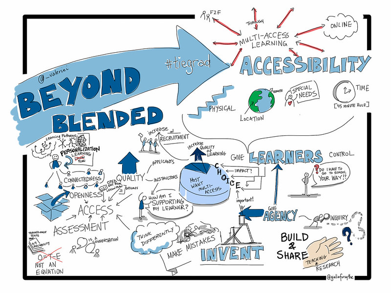

## Learning Activities

#### :fa-camera: Learning Activity 2.3 - Read and Reflect

This Learning Activity begins by asking you to take a close look and consider the following picture:

***Next,*** read [**Realigning Higher Education for the 21st-Century Learner through Multi-Access Learning**](https://jolt.merlot.org/vol9no2/irvine_0613.htm) by Irvine, Code and Richards (2013).

---

#### ***Questions to Consider...***

After taking some time to consider the picture, along with completing the reading above, consider the following questions:

 - ***What ideas surround multi-access learning, according to the image?***
 - ***What is your definition of multi-access learning?***
 - ***If you were asked to provide multi-access learning for your course, what initial questions would you have?***
