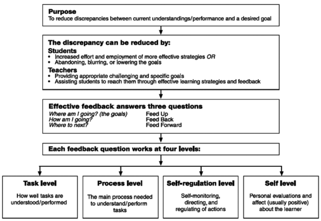

Please take a few minutes to read Hattie's [book section *Feedback in schools*](http://visiblelearningplus.com/sites/default/files/Feedback%20article.pdf) (PDF download...sorry).

As you read, make note in particular of the three feedback questions, `Where am I going?`, `How am I going?` and `Where to next?` and also the four levels of feedback, `task, process, self-regulation, and self`.



```
facilitators don't need fb from an academic perspective, but translating faculty fb into actionable steps for students. focus on formative fb in coaching and facilitation settings
facilitating the relationship btwn faculty and learner
```
