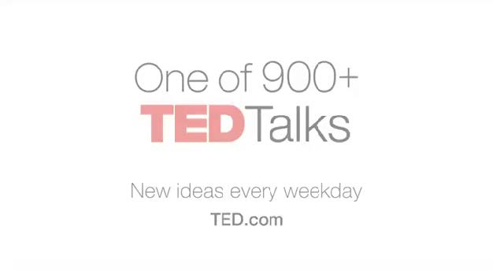
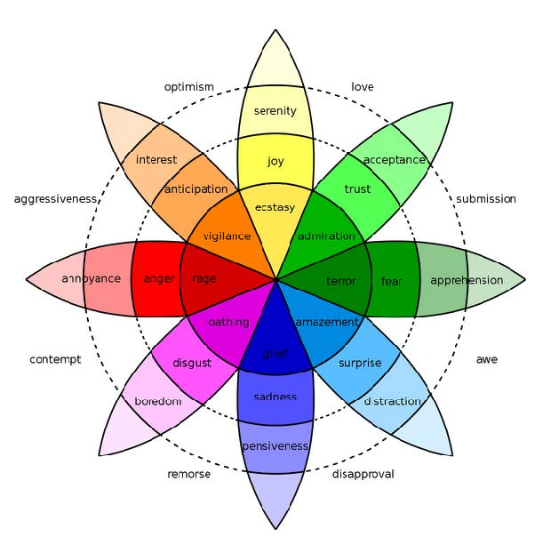

# Coaching
### LDRS 663

---

# Peer Coaching Practice Session

- Working with another student, use the G.R.O.W. model to coach each other through the process of planning for a particular learning activity within this course (such as, your facilitation resource project).
- There are two outcomes to assessment:
  - you will produce a Zoom recording of your coaching session, and
  - you will write a 1-2 page reflection on your actions coaching your peer’s learning.

---

# What is **coaching**?

---

> Coaching is a way of being, listening, asking, and
speaking that draws out and augments characteristics
and potential that are already present in a person. ~Gallwey, 1997

---

# Michaelangelo's Principle

> Every block of stone has a statue inside it and it is the task of the sculptor to discover it.”

---

---

# Developing Learning Capability

---

- Learning, coaching, and building a learning culture are critical to the multi-access education model.
- Growing learners’ learning capability is equivalent to increasing an institution’s teaching presence.
- We don’t really need to learn how to learn; we need to remove our resistance to learning and coaching.

---

# Aims of coaching for Learning

---

- Increase capacity for learning performance:
  - by actualizing potential;
  - or, by decreasing interference;
  - or, by a combination of both.

---

# Learning Performance = Potential - Interference
~Gallwey, 1997

---

# Core Coaching Competencies

---

- Practicing Professional Ethics & Standards
- Cultivating Trust & Safety
- Holding Space/ Presence
- Active Listening
- Asking Questions
- Creating Awareness
- Setting (SMART) Goals
- Designing Action Plans
- Checking for Results

---
# Listening

---

The reality is that
> “to [truly] listen is very hard, because it asks of us so much interior stability that we no longer need to prove ourselves by speeches, arguments, statements or declarations. True listeners no longer have an inner need to make their presence known. They are free to receive, welcome, to accept”.
~Henri Nouwen

---

# Levels of Listening

---

- Avoidance Listening = **Listening Over**
- Defensive Listening = **Listening At**
- Problem-Solving Listening = **Listening To**
- Listening to Learn = **Listening Into**
~Goulston & Ullmen (2013)

---

# Why is “listening into” the inner world of the learner’s lived-experience so difficult?

---

# Reason: We listen autobiographically

---

- We listen with the intent to reply, not to understand what the other person is trying to say.
- We listen to our own self-talk as we prepare what we are going to say, ask, etc.
- We filter everything we hear through our life experiences, our own frame of reference.
- We check what we hear against our own autobiography and see how it measures up.

---

- We decide what the other person means before he/
she finishes communicating, saying things like:
  - "I know just how you feel.”
  - “I felt the same way."
  - "I had that same thing happen to me."
  - "Let me tell you what I did in a similar situation."

---

# Other Common Barriers to Effective Listening

---

- We see silence as agreement
- We feel the pressure of time (we don’t have time)
- We are impatient/disinterested
- We lack of know-how
- We simply don’t pay close attention

---

# We Need to Learn to “Listen Into” Learner’s Worlds Consciously

---

# Julian Treasure (2011) provides us with critical insights into how we can listen consciously.

---

---

# How can we listen consciously to our learners’ inner world’s to truly understand them?

---

# Our Listening Positions Need to Match the Situation

- Active vs. Passive
- Reductive vs. Expansive
- Critical vs. Empathetic

---

# Coaching for learning requires Active Listening

---

")

---

# Pay Attention
1. Be present; focus on the moment
2. Observe body language; your own and the learner’s.
3. Pre-empt distractions.
---

# Hold Judgement
1. Practice empathy; seeking to make the learner “feel” felt and heard.
2. Try to understand learner’s “lens”.
3. Be patient.

---

> Silence is a source of great strength.
~Lao Tzu

---

# Reflect
1. Paraphrase (“What I am hearing is...”)
2. Name emotions you observe
3. Be a “mirror”

---

---

# Clarify
1. Use open-ended questions (“What might you do next?).
2. Use clarifying questions (“Let me see, if I’m clear?”).
3. Use probing questions (“What tactics have you tried?”).

---

# Summarize
1. Use “So” periodically (“So, what I have heard so far…”).
2. Use “So” at the end (So, let me summarize what I have heard…”).
3. Ask the other person to summarize.

---

# Share
1. Be an active participant in the conversation.
2. Share thoughts, feelings, and experiences to deepen and/or check for understanding.
3. Ask the learner about your impact on him or her.
---

# G.R.O.W. Coaching Model

---

# Goal Setting
- Setting short and long term learning goals.
- Key questions to ask:
  - What can you do with my time that is important?
  - What learning outcome do you want?
  - How much time do you need to achieve that outcome?
  - How does what you am doing now help you achieve the longer term learning outcomes I really want?
---

# Make Your Goals S.M.A.R.T.

---

## Specific
- Your goal should be clear and specific.
- Ask yourself:
  - What do I want to accomplish in this course?
  - Why is this learning goal important to you?
  - What is involved in achieving this goal?

---

## Measurable
- You should be able to track your progress.
- Ask yourself:
  - How much time is involved?
  - How will you know when it is accomplished?

---

## Attainable
- Your goal should be realistic and achievable.
- Ask yourself:
  - How can you accomplish this goal?
  - Do you have the resources to achieve it?

---

## Relevant
- Your goal should matter and align with your other
goals.
- Ask yourself:
  - Is the goal worthwhile?
  - Is the time right?
  - Does it help you achieve what you ultimately want?

---

## Time-bound
- Your goal should have a deadline to focus on.
- Ask yourself:
  - When?
  - What can I do now?

---

# Reality Checking
- Understanding where you really are relative to what
you really want.
- Key questions to ask:
  - What is really going on?
  - What have you done/tried?
  - Have you noticed any patterns?
  - How do you know this is accurate?

---

# Identifying Obstacles to Achieving Goals

---

- Critical to identify if there’s more than one obstacle.
- Key questions to ask:
  - What is preventing you from achieving your goals?
  - What else is preventing you?
  - What do you have to change about yourself to achieve your goals?
  - What is preventing you from changing?

---

# Common Obstacles to Learning Goals
- Assumption that “I already know”
- Assumption that learning means remediation
- Fear of being judged
- Doubt
- Trying too hard to learn and to appear learned
~Gallwey, 1997

---

# Option Exploration
- Key questions to ask:
  - What alternatives do you have?
  - Who can support you?
  - What are the pros and cons of that option?
  - What is the preferred option you want to act on?

---

# Reframing Questions
- What am you not seeing?
- What is a better position to take?
- Is this problem the root problem or a symptom of it?
- Why is this problem problematic?

---

# The Way Forward
- Key questions to ask:
  - What commitments am I going to make?
  - What are my next steps?
  - In what timeframe?
  - What do I think might get in the way?
  - How will I track my progress?
  - What support do I need? How will I get it?

---

# Creating Action Strategies
- Set SMART Goal(s) (the job to be done)
- Breakdown the Work (into a list of tasks)
- Define the Critical Path (the order of tasks)
- Schedule the Work (when you do what)
