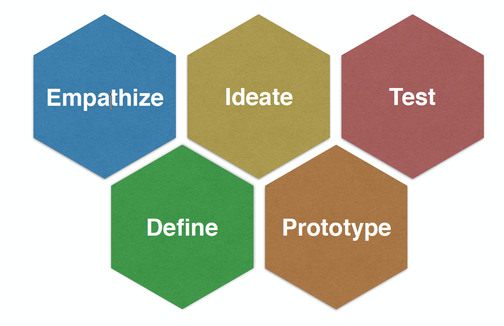
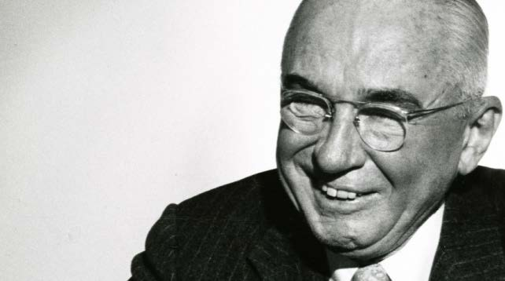
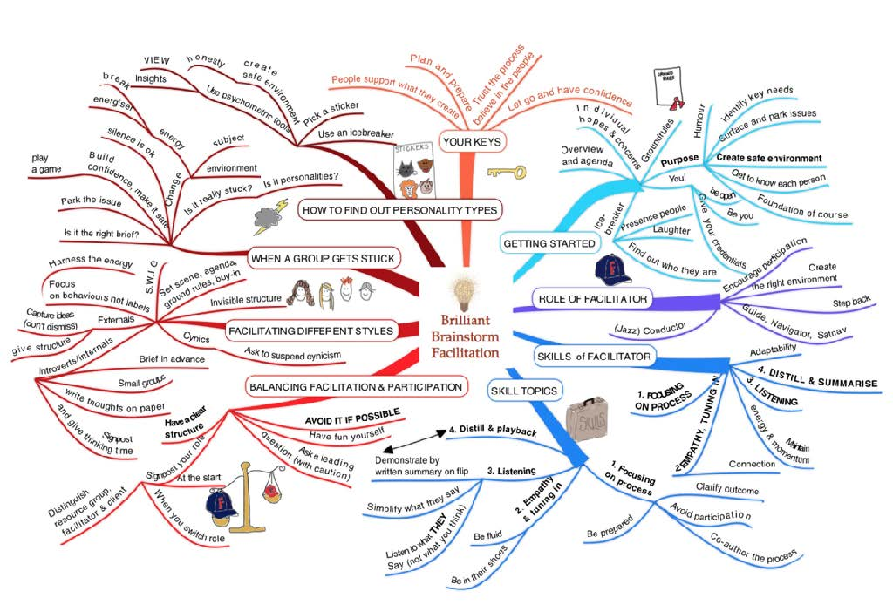
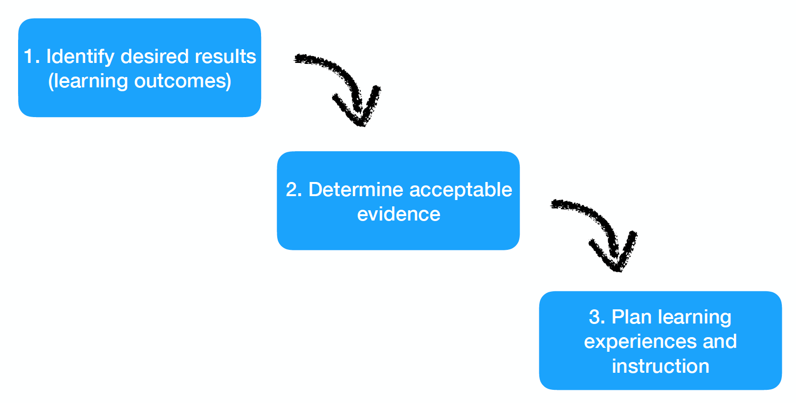

# Facilitated Learning Design
### LDRS 663

---

# Topics

Design Thinking  
Backwards Learning Design  
Designing a Learning Facilitation Guide

---

# Design Thinking

---

# What is **design**?

---

## Design is the world we have made.

---

> Design is a funny word. Some people think design means how it looks. But of course, if you dig deeper, it's really how it works. ~ Steve Jobs

---

> Design is the fundamental soul of a man-made creation that ends up expressing itself in successive outer layers of the project, or service. ~ Steve Jobs

---

# Who designs?

---

> Everyone designs who devises courses of action aimed at changing existing situations into preferred ones. ~ Herbert Simon

---

## Educators are designers of learning experiences.

---

# What makes design **good**?

---

Christopher Alexander defines good design as the **goodness of fit** between the parts of the world over which we have control, what designers call **form**, and form’s **context** in the world as it is.

---

---

# Good design requires good methodology

---
# Stanford's d:School **Design Thinking** Model

---

---

# Empathize

- Empathy work is about **connecting** with people and **seeking** their stories as it relates to a design issue.
- You empathize by:
  - **Observing** users and their behaviour in the context of their lives.
  - **Engaging** in interviewing conversations that systematically ask ever deeper why questions.
  - **Watch and Listen** to the user’s environment.

---

# Define

- Definition work is about bringing clarity, focus, and meaning to an articulation of the design challenge.
- You define the design space by articulating
  - Who is the **user**?
  - What **needs** are important to fulfill?
  - What **insights** have you gained?

---

# Ideate

- Ideation work is about generating new ideas, which provides the source material for making prototypes.
- You ideate by
  - **Combining your *conscious* and *unconscious* mind and *rational* thoughts with *imagination*.
  - Using **brainstorming** to leverage the synergy of the group to reach new ideas.
  - Adding **constraints** and seeking **inspirations**.

---

# Alex F. Osborn

[.column]

- 1919, Osborn joined with Bruce Fairchild Barton and Roy Sarles Durstine to form the BDO advertising agency.
- 1928, Osborn led BDO’s merger with the George Batten Co. to create BBDO (a major global advertising firm).

[.column]

---

# Osborn's Creative Brainstorming Rules

- focus on quantity
- withhold criticism
- welcome unusual ideas
- combine and improve ideas

---

---

# How do we **combine** and **improve** ideas?

---

# SCAMPER
- Substitute
- Combine
- Adapt
- Modify
- Put to other purposes
- Eliminate
- Rearrange

---

# Prototype

- Prototype work is about iteratively making low resolution solutions to answer design questions.
- You prototype by:
  - **Building**, even if you don’t know what you are doing.  
  - **Not spending too long** on any one solution.
  - **Identifying specific design questions** (variables) to be answering by building a particular prototype.
  - **Keeping the user in mind.**

---

# Test

- Testing work is about getting feedback about your design prototypes from your user to gain empathy and insights into the “goodness of fit” of your evolving design solutions.
- You test by:
  - **Showing not telling.** Letting your users play with prototypes and observing how they use them.
  - **Creating experiences.** Test your prototypes in ways that let’s your User experience how it feels to use the solution, rather than explaining it to them.
  - **Ask user to compare** multiple prototypes.

---

# **Iteration** is fundamental to good design.

- Iterate both by:
  - Cycling through the process multiple times.
  - And by iterating within a step—for example by creating multiple prototypes or trying variations of a brainstorming topics with multiple groups.

---

# Backwards Learning Design

---

- The book Understanding by Design by Grant Wiggins and Jay McTighe (1998) introduced a framework for designing learning experience called “Backward Design.”
- Two big ideas define the framework:
  - Begin the learning design by **clarifying the learning outcomes,** rather than focusing on learning activities.
  - **Use authentic task-based learning** to assess learning outcomes.

That is, Wiggins and McTighe (2005) argue:

> understanding is revealed in performance (p. 153)

---

# The three stages of backward learning design.

---

---

# Stage 1: Identify desired results

- What should participants hear, read, view, explore or otherwise encounter?
- What knowledge and skills should participants master?
- What are big ideas and important understandings participants should retain?

---

# Stage 2: Determine acceptable evidence

- How will I know if learners have achieved the desired results?
- What will I accept as evidence of learner understanding and proficiency?

---

# Assessment Evidence

- Wiggins and McTighe (2005) argue
> assessment of understanding must be grounded in authentic performance-based tasks (p. 153).
- Wiggins and McTighe (2005) list the following criteria for designing authentic tasks to assess learning:

---

1. The task is set in a scenario that replicates or simulates the ways in which a person’s knowledge and abilities are tested in real-world situations.

---

2. Requires judgment and innovation. The learner has to use knowledge and skills wisely and effectively to address challenges or solve problems that are relatively unstructured. Rather than a specific prompt or cue that tests a discrete piece of knowledge, realistic challenges require the learner to figure out the nature of the problem. What kind of knowledge and skill is being tapped here? How should I tackle it? Even when the goal may be quite clear, the learner has to develop a plan and a procedure for solving the problem or addressing the issue.

---

3. Asks the learner to “do” the subject. Instead of reciting, restating, or replicating through demonstration what he was taught or already knows, the learner has to carry out exploration and work in the discipline of [leadership, history, psychology, etc.]. The learner’s efforts resemble or simulate the kind of work done by people in the field.

---

4. Replicates key challenging situations in which [professionals] are truly “tested” in the workplace, civic life, and in personal life. Real challenges involve specific situations with “messiness” and meaningful goals: important constraints, “noise,” purposes, and audiences at work. . . .

---

5. Assesses the learner’s ability to efficiently and effectively use a repertoire of knowledge and skill to negotiate a complex and multistage task. . . .

6. Allows appropriate opportunities to rehearse, practice, consult resources, and get feedback on and refine performances and products. . . . As the apprenticeship model in the trades has proven, learning is maximized when cycles of perform-feedbackrevise- perform guide the production of known high-quality products, judged against public performance standards. (p. 154)

---

# Stage 3: Plan learning experiences and instruction

- What enabling knowledge (facts, concepts, principles) and skills (processes, procedures, strategies) will learners need in order to perform effectively and achieve desired results?
- What activities will equip learners with the needed knowledge and skills?

---

- What will need to be taught and coached, and how should it best be taught, in light of performance goals?
- What materials and resources are best suited to accomplish these goals?

---

# Designing a Learning Facilitation Guide

---

# The Facilitation Guide...
- Is **NOT** a course design, or instructional lesson plan.

---

- Is a guide for:
  - setting up and maintaining the learning environment;
  - scheduling the critical path of learning activities within a given time period for a specific group of learners;

---

  - putting the course into meaningful context (culturally, linguistically, socially, technologically) for a specific group of learners;
  - setting the agenda and running group learning activities;
  - checking-in and ensuring learners are “grasping” the course.

---

# GRASP Checklist

- Goal: help learners understanding the “why” underlying the performance task by identifying the goal, problem, challenge, or aspiration involved in the learning task.
- Role: help define the role of the learner(s) in the task.
- Audience: help identify the ultimate real-world target audience within the context of the learning scenario (Help learners identify who would this assignment matter to?)

---

- Situation: help learners to understand the context of the scenario, explaining the learning situation.
- Product: help clarify what the learner(s) will create and why they will create it.
- Standards: help learners develop a clear picture of success, help them understand the rubric (formal and hidden) for assessing the learning task(s) being assigned.
