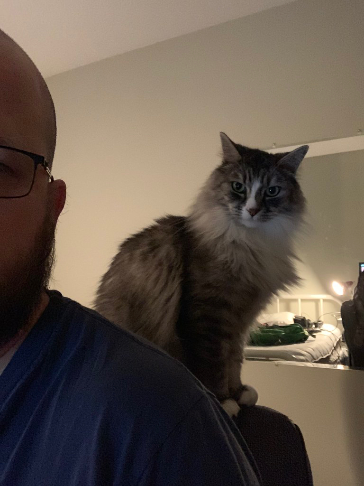

Hi everyone!

I'm your instructor for this course. During the Summer of 2019, I'm teaching EDCI 335 (May-June) and EDCI 339 (July-August) at the University of Victoria.

My day job is *Manager of Online Learning and Instructional Technology* at a university in the Lower Mainland, which has me working directly at the intersection of technology and learning every day.

I'm also a PhD student in the Department of Curriculum and Instruction at UVic studying how online learning can increase access to higher ed for Indigenous learners. You can find my personal blog where I am learning in the open at [grav.madland.ca](https://grav.madland.ca).

I've worked in Ed Tech since I began my K-12 teaching career in 2000, and in universities in BC since 2010.

I currently live in Richmond, BC with my wife and 2 of our 3 children. We have a son just finishing Grade 5, a daughter just finished her first year of Nursing, and a son in Kamloops just finished his 3rd year in the Bachelor of Interdisciplinary Studies and who is married to a teacher candidate just starting her BEd this fall.

### Cat Tax

Here's a picture of me trying to get some writing done while being judged by one of our 2 cats.

---
