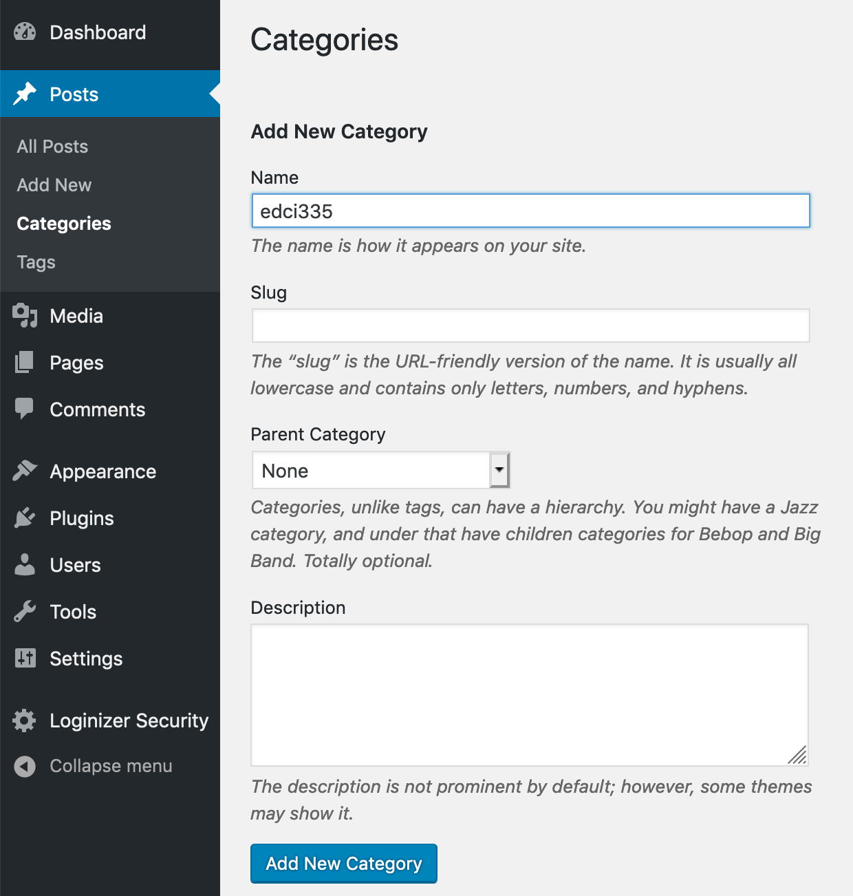
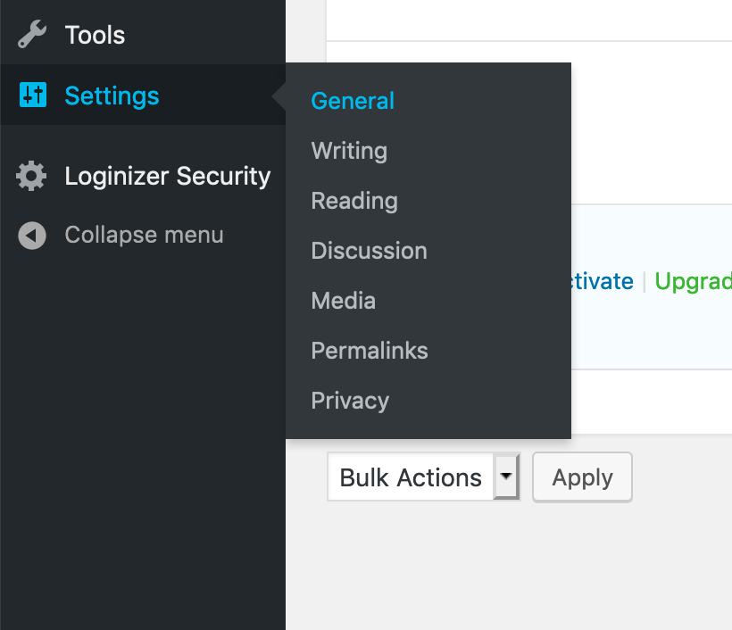

Using a blog for course communications has some distinct advantages over a typical course in an LMS (Learning Management System, like Moodle). One advantage is that you are in control over your work and you won't necessarily lose access to your work after you complete the course or leave UVic. Another is that blogging on a public site allows for a wider audience for your work, rather than a single instructor.

There are some things that you *MUST* to do to make this model of course work properly, and some things that will make it a richer experience for everybody.

### Categories

One of the first things you should do on your new blog is to create a course category.

##### On your Dashboard, tap `Posts`, then choose `Categories`.

##### On the `Categories` page, add a new category `edci335`.
- no spaces
- lowercase
- leave the `slug` blank
- exactly as you see it below*

!! \*If you are in a different course, like EDCI 339, then use that course number.

##### Tap `Add New Category`.

!!! Every time you publish a post for this course, you **MUST** use the category for this course. If you are taking EDCI335, then use the category `edci335` on every post.

[Click here to learn more about using categories to organize your site.](https://onlineacademiccommunity.uvic.ca/wordpress-tutorials-the-dashboard/wordpress-tutorials-organizing-content/)

### Customizing your site.

There are thousands of ways that you can customize your site, and you are encouraged to do so. Consider this *your* site, the beginnings of your domain on the web.

#### Adjust your site settings.

Scroll through the settings panel on your site and adjust the Title and tagline of your site, set the correct timezone, determine who can post comments (if anyone), change the permalink structure. Feel free to experiment with these settings.

#### Change the Theme.

Tap `Appearance`, then `Themes` to choose a different theme. There are tens of thousands of themes available, but you may only have access to a limited number, depending where your blog is.

#### Customize your Theme.

Tap `Customize` in the Admin Bar (top of the page) and you will get a menu of items that you can adjust. *Every theme will have different options.* Sometimes, you will be able to customize the header image, the fonts used, menu locations, and other things.

#### Add a Social Menu.

Some themes will have a template that you can use to include links to your social media profiles. You can often find these settings under `Appearance > Menus`

! One caution! Don't spend too much time fiddling with the appearance of your site. It can be very easy to get sucked into a vortex of trying to get the appearance *exactly* how you want it. It is best to focus on content first, then the appearance.

---
